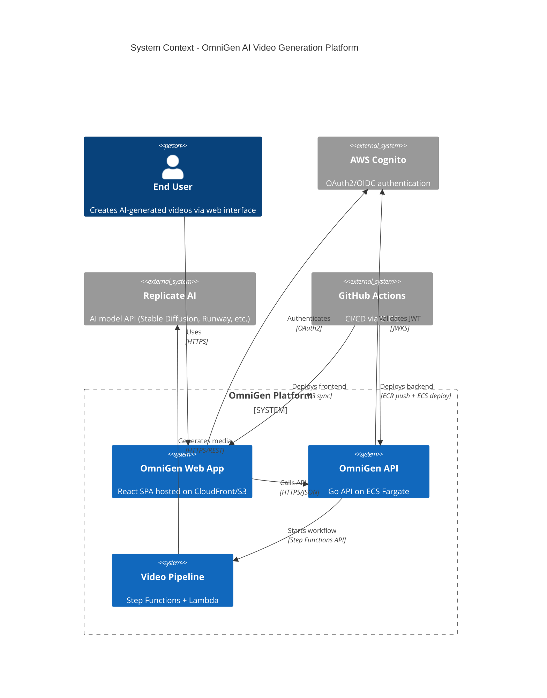
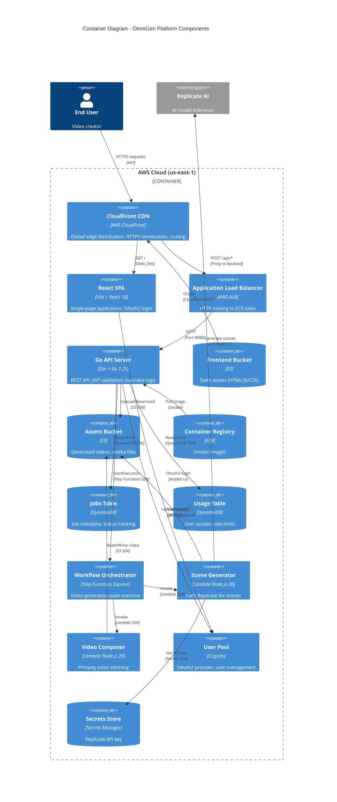
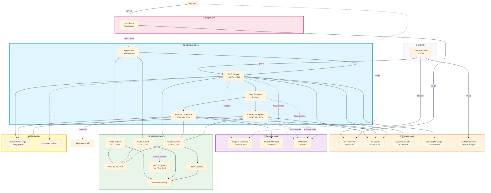
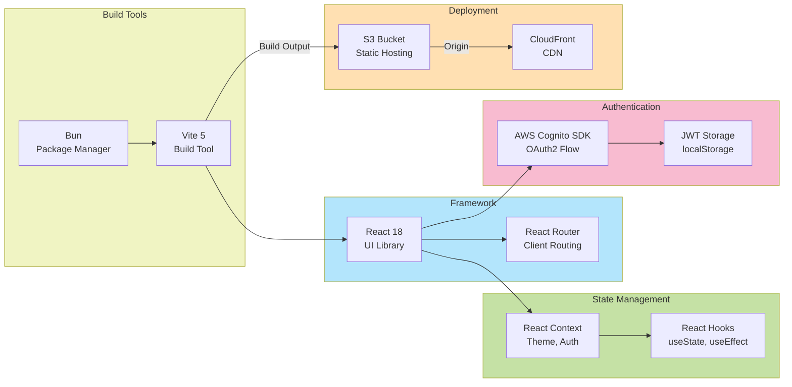
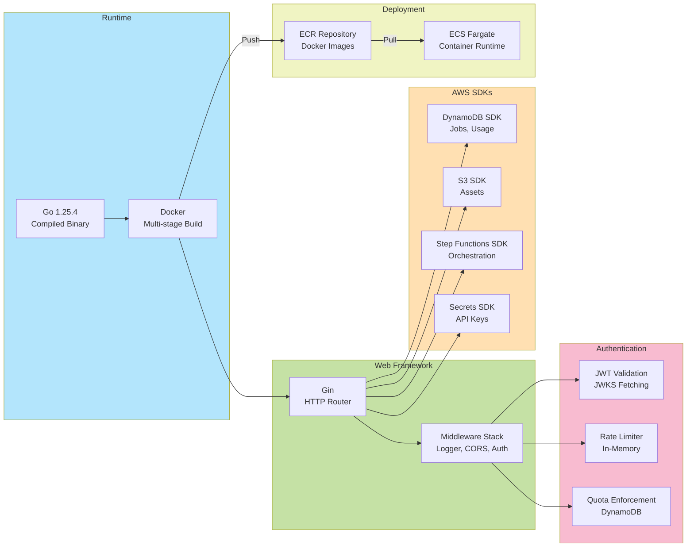
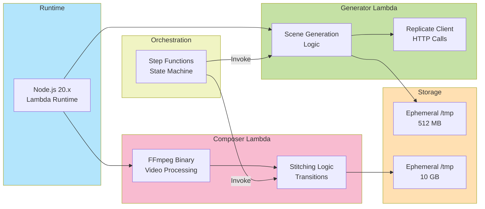
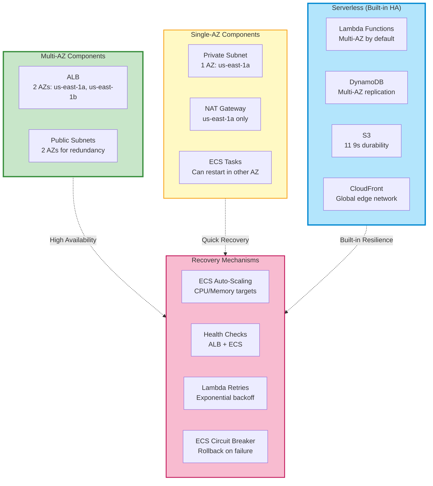

# Architecture Overview

> High-level system architecture for OmniGen AI video generation pipeline

## System Context (C4 Level 1)

This diagram shows the OmniGen system from a bird's-eye view, including external actors and systems.

---

## Container Diagram (C4 Level 2)

This diagram shows the major containers (applications/services) within the OmniGen system.

---

## AWS Services Architecture

This flowchart shows all AWS services and their relationships with color-coding by service category.

---

## Technology Stack

### Frontend Stack

### Backend Stack

### Serverless Stack (Lambdas)

---

## High Availability & Disaster Recovery

---

## Key Architecture Decisions

| Decision | Why | Trade-off |
|----------|-----|-----------|
| **Hybrid ECS + Lambda** | ECS for always-on API (predictable load), Lambda for video processing (bursty, event-driven) | Increased complexity vs optimal cost |
| **Step Functions Express** | Video generation < 5 min, 50% cheaper than Standard | No long-term execution history (90 days max) |
| **Single-AZ Private Subnet** | Cost savings: 1 NAT vs 2 NATs = $32/month saved | Lower HA, but ECS can restart quickly |
| **DynamoDB On-Demand** | Unpredictable traffic for new product, zero capacity planning | Higher per-request cost vs provisioned |
| **CloudFront + ALB** | Single domain for frontend + API (no CORS complexity) | Dual routing architecture |
| **Cognito for Auth** | Managed OAuth2/OIDC, SOC2 compliant, < 50K MAU free | AWS vendor lock-in |
| **GitHub OIDC** | No long-lived AWS credentials, auto-rotation | One-time setup complexity |

---

**Related Documentation:**
- [Network Topology](./network-topology.md) - Detailed VPC architecture
- [Data Flow](./data-flow.md) - Request/response sequences
- [Infrastructure Modules](./infrastructure-modules.md) - Terraform structure
