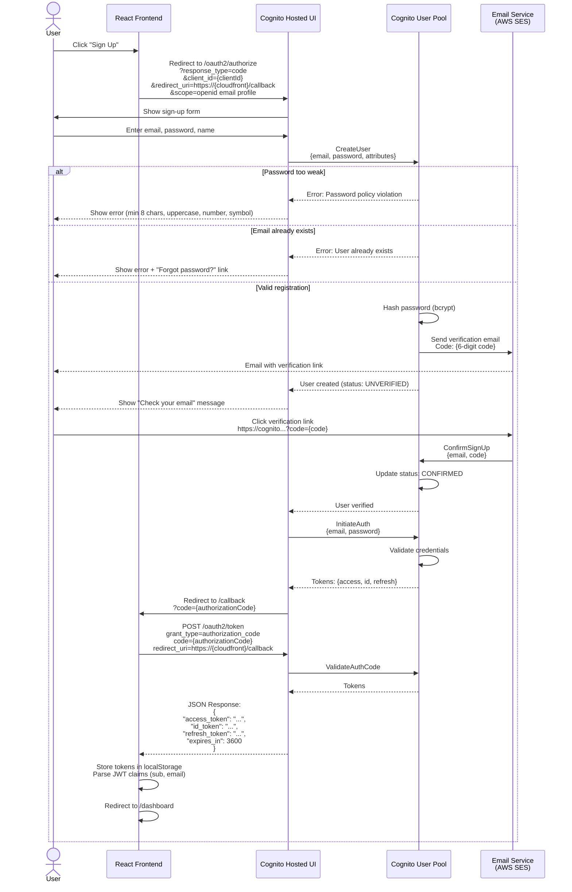
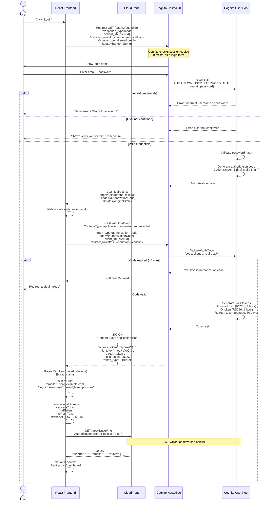
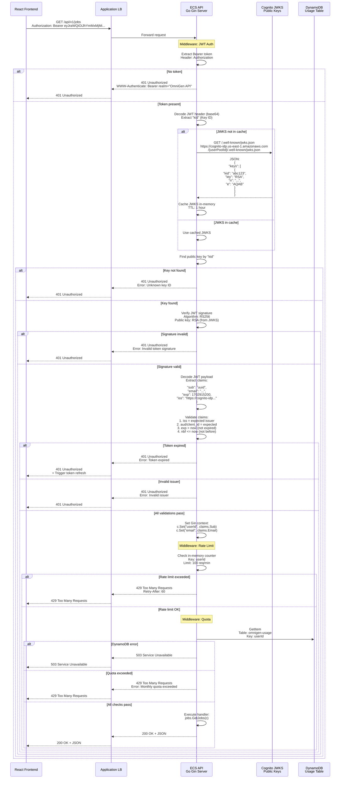
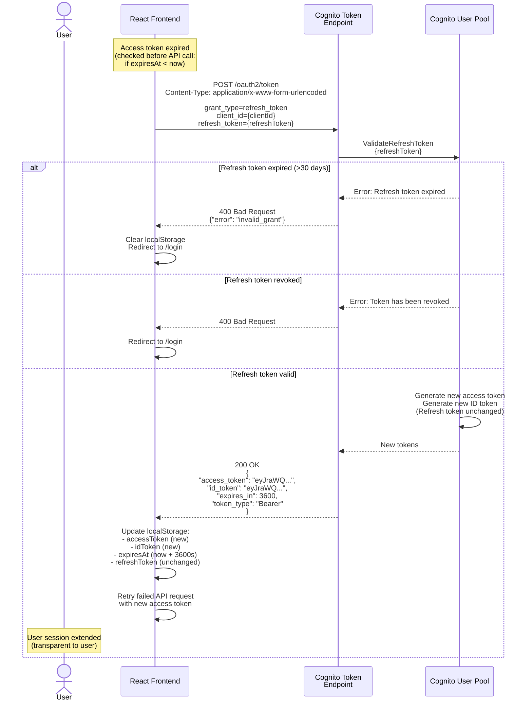
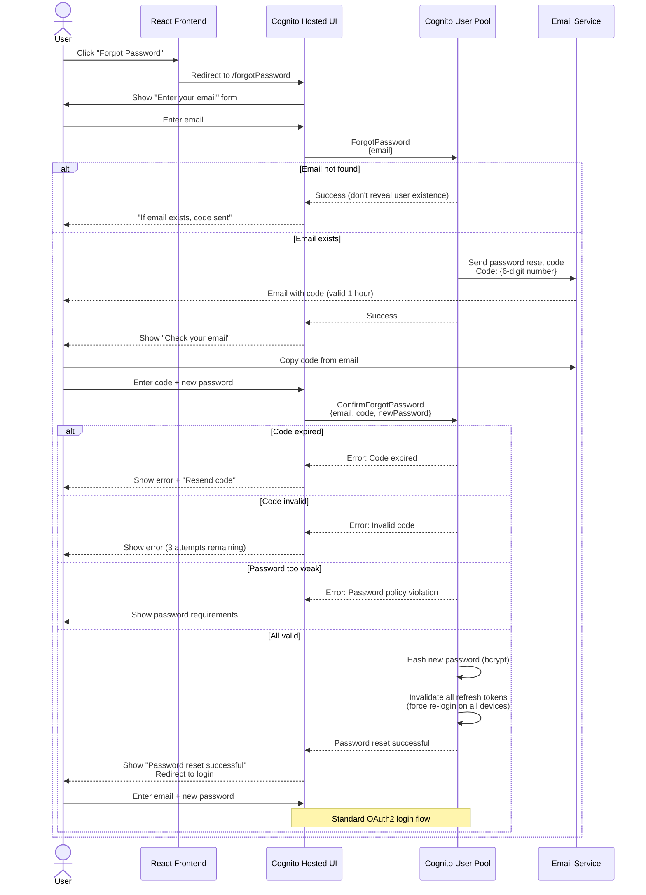

# Authentication Flow

> Cognito OAuth2/OIDC authentication with JWT validation and security controls

## Overview

OmniGen uses **AWS Cognito User Pool** for authentication, implementing the **OAuth 2.0 Authorization Code Grant** flow with **OIDC (OpenID Connect)** tokens. All API requests require valid JWT tokens validated against Cognito's public keys.

**Security Features:**
- OAuth2/OIDC standard compliance
- JWT with RS256 signature verification
- HttpOnly cookies for XSS protection (future)
- Rate limiting (100 requests/min per user)
- Quota enforcement (10 videos/month per user)
- HTTPS-only communication
- JWKS key rotation support

**Cognito Configuration:**
- User Pool ID: `us-east-1_{random}`
- Client ID: App client for frontend
- Hosted UI: `https://omnigen.auth.us-east-1.amazoncognito.com`
- Token Expiration: Access token (1 hour), Refresh token (30 days)

---

## User Registration Flow

New user sign-up via Cognito Hosted UI with email verification.



**Password Policy (Cognito):**
- Minimum length: 8 characters
- Require: Uppercase, lowercase, number, special character
- No common passwords (checked against breach database)

**Email Verification:**
- Code valid for: 24 hours
- Resend limit: 5 per hour (Cognito throttling)

---

## OAuth2 Login Flow

Existing user login via Cognito Hosted UI (Authorization Code Grant).



**OAuth2 Parameters:**
- `response_type=code`: Authorization Code Grant (most secure for SPAs)
- `client_id`: Public client (no client secret needed for PKCE)
- `redirect_uri`: Must match Cognito app client configuration
- `scope`: `openid email profile` (OIDC standard scopes)
- `state`: CSRF protection (random string validated on callback)

**Token Storage:**
- **Current:** localStorage (accessible to JavaScript, XSS risk)
- **Future:** HttpOnly cookies (immune to XSS, requires backend cookie management)

---

## JWT Validation Flow

Backend validates JWT on every API request using Cognito's public keys (JWKS).



**JWT Structure (Access Token):**

**Header:**
```json
{
  "kid": "abc123",
  "alg": "RS256"
}
```

**Payload:**
```json
{
  "sub": "e5b3f8d2-1234-5678-9abc-def012345678",
  "email": "user@example.com",
  "cognito:username": "user@example.com",
  "iss": "https://cognito-idp.us-east-1.amazonaws.com/us-east-1_ABC123",
  "client_id": "7abcdefghijk1234567890",
  "origin_jti": "...",
  "token_use": "access",
  "scope": "openid email profile",
  "auth_time": 1702914000,
  "exp": 1702917600,
  "iat": 1702914000,
  "jti": "..."
}
```

**Signature:** RS256 (RSA SHA-256) verified with Cognito public key

**Performance:**
- JWKS fetch: ~100ms (first request only, then cached 1 hour)
- Signature verification: ~5ms (CPU-bound crypto operation)
- Claims validation: <1ms (simple comparisons)
- **Total:** ~5-10ms per request (after JWKS cached)

---

## Token Refresh Flow

Automatically refresh expired access tokens using long-lived refresh tokens.



**Refresh Token Characteristics:**
- **Lifetime:** 30 days (configurable in Cognito)
- **Format:** Opaque string (not JWT, cannot be decoded)
- **Rotation:** Cognito can rotate refresh tokens on use (disabled by default)
- **Revocation:** User logout or admin action revokes all refresh tokens

**Frontend Implementation:**
```javascript
// Axios interceptor for automatic token refresh
axios.interceptors.response.use(
  response => response,
  async error => {
    if (error.response?.status === 401) {
      const refreshToken = localStorage.getItem('refreshToken');
      if (refreshToken) {
        try {
          const { data } = await axios.post('https://cognito.../oauth2/token', {
            grant_type: 'refresh_token',
            client_id: CLIENT_ID,
            refresh_token: refreshToken
          });
          localStorage.setItem('accessToken', data.access_token);
          localStorage.setItem('idToken', data.id_token);
          localStorage.setItem('expiresAt', Date.now() + data.expires_in * 1000);

          // Retry original request with new token
          error.config.headers.Authorization = `Bearer ${data.access_token}`;
          return axios.request(error.config);
        } catch (refreshError) {
          // Refresh failed, logout user
          localStorage.clear();
          window.location.href = '/login';
        }
      }
    }
    return Promise.reject(error);
  }
);
```

---

## Password Reset Flow

Forgot password flow via Cognito with email verification code.



**Security Measures:**
- **Rate Limiting:** 5 reset requests per hour per email (Cognito enforced)
- **Code Expiration:** 1 hour (configurable)
- **Code Attempts:** 3 attempts before code invalidation
- **User Enumeration Protection:** Always return success, even if email not found
- **Token Revocation:** All refresh tokens invalidated on password reset

---

## Security Architecture

Comprehensive view of authentication and authorization security layers.

```mermaid
flowchart TB
    User([End User])

    subgraph Frontend[\"React Frontend (CloudFront)\"]
        Login[Login Component]
        Storage[Token Storage<br/>localStorage]
        Interceptor[Axios Interceptor<br/>Auto-refresh]
    end

    subgraph Cognito[\"AWS Cognito\"]
        HostedUI[Hosted UI<br/>OAuth2 Flows]
        UserPool[User Pool<br/>Identity Store]
        JWKS_Endpoint[JWKS Endpoint<br/>Public Keys]
        TokenEndpoint[Token Endpoint<br/>/oauth2/token]
    end

    subgraph Backend[\"Go API (ECS Fargate)\"]
        Middleware[Middleware Stack]

        subgraph AuthStack[\"Authentication Layers\"]
            JWTMiddleware[JWT Validation<br/>RS256 Signature]
            RateLimit[Rate Limiter<br/>100 req/min]
            Quota[Quota Enforcement<br/>10 videos/month]
        end

        Handler[Route Handlers<br/>Business Logic]
    end

    subgraph Storage[\"Data Layer\"]
        DDB_Usage[DynamoDB Usage<br/>Quota Tracking]
        CloudWatch[CloudWatch Logs<br/>Audit Trail]
    end

    subgraph Security[\"Security Controls\"]
        HTTPS[TLS 1.2+<br/>All Communication]
        CORS_Policy[CORS Policy<br/>CloudFront Domain]
        CSP[Content Security Policy<br/>XSS Prevention]
        PasswordPolicy[Password Policy<br/>8+ chars, complexity]
    end

    User --> Login
    Login --> HostedUI
    HostedUI --> UserPool
    UserPool --> TokenEndpoint
    TokenEndpoint --> Storage
    Storage --> Interceptor
    Interceptor --> Middleware

    Middleware --> JWTMiddleware
    JWTMiddleware -.->|Fetch public keys| JWKS_Endpoint
    JWTMiddleware --> RateLimit
    RateLimit --> Quota
    Quota --> Handler

    Quota --> DDB_Usage
    Handler --> CloudWatch

    HTTPS -.->|Enforces| User
    HTTPS -.->|Enforces| Backend
    CORS_Policy -.->|Protects| Backend
    CSP -.->|Protects| Frontend
    PasswordPolicy -.->|Enforces| UserPool

    style AuthStack fill:#f8bbd0,stroke:#c2185b,stroke-width:2px
    style Security fill:#c8e6c9,stroke:#388e3c,stroke-width:2px
    style Cognito fill:#e1f5ff,stroke:#0288d1,stroke-width:2px
```

---

## Security Best Practices

### Current Implementation

| Security Control | Status | Details |
|-----------------|--------|---------|
| **HTTPS Only** | ✅ Enforced | CloudFront + ALB enforce TLS 1.2+ |
| **JWT Signature Verification** | ✅ Implemented | RS256 with Cognito public keys (JWKS) |
| **Token Expiration** | ✅ Enforced | Access token: 1 hour, Refresh: 30 days |
| **Rate Limiting** | ✅ Implemented | 100 requests/min per user (in-memory) |
| **Quota Enforcement** | ✅ Implemented | 10 videos/month per user (DynamoDB) |
| **CORS Policy** | ⚠️ Permissive | `Access-Control-Allow-Origin: *` (MVP only) |
| **HttpOnly Cookies** | ❌ Not Implemented | Tokens stored in localStorage (XSS risk) |
| **CSRF Protection** | ✅ Partial | OAuth2 `state` parameter validates redirects |
| **Password Policy** | ✅ Enforced | 8+ chars, uppercase, lowercase, number, symbol |
| **Audit Logging** | ✅ Implemented | CloudWatch Logs (all auth events) |

### Production Hardening (Future)

**High Priority:**
1. **HttpOnly Cookies for Tokens**
   - Move from localStorage to secure HttpOnly cookies
   - Backend manages cookie lifecycle (Set-Cookie header)
   - Prevents XSS token theft

2. **Restrict CORS to CloudFront Domain**
   ```javascript
   Access-Control-Allow-Origin: https://{cloudfront-domain}
   Access-Control-Allow-Credentials: true
   ```

3. **Implement PKCE (Proof Key for Code Exchange)**
   - Add `code_challenge` and `code_verifier` to OAuth2 flow
   - Protects against authorization code interception

4. **Add Content Security Policy (CSP)**
   ```http
   Content-Security-Policy: default-src 'self'; script-src 'self' 'nonce-{random}'
   ```

**Medium Priority:**
5. **Multi-Factor Authentication (MFA)**
   - Cognito supports TOTP (Google Authenticator) and SMS
   - Enforce for admin accounts

6. **Persistent Rate Limiting**
   - Move from in-memory to Redis/DynamoDB
   - Prevents rate limit bypass via ECS task restart

7. **IP-Based Geo-Blocking**
   - AWS WAF to block high-risk countries
   - Reduce credential stuffing attacks

8. **Advanced Threat Protection**
   - Cognito Advanced Security (risk-based auth)
   - Detects compromised credentials, unusual login patterns

---

## Authentication Metrics

### Cognito Limits (Free Tier)

| Metric | Free Tier | Paid Tier |
|--------|-----------|-----------|
| **Monthly Active Users (MAU)** | 50,000 free | $0.0055 per MAU |
| **Sign-up/Sign-in Requests** | Unlimited | Unlimited |
| **Token Refresh Requests** | Unlimited | Unlimited |
| **JWKS Endpoint** | Unlimited | Unlimited |
| **SMS MFA** | 50 free/month | $0.00645 per SMS |

**Current Usage:** ~10 users (well under free tier)

### Performance Metrics

| Operation | Latency | Cost |
|-----------|---------|------|
| **OAuth2 Login** | 500-1000ms | Free (Cognito) |
| **JWT Validation** | 5-10ms | $0 (CPU cost included in ECS) |
| **JWKS Fetch** | 100ms | Free (cached 1 hour) |
| **Token Refresh** | 200-300ms | Free (Cognito) |
| **Rate Limit Check** | <1ms | $0 (in-memory) |
| **Quota Check (DynamoDB)** | 5-10ms | $0.00005 per request |

---

## Troubleshooting

### Common Issues

**1. Token Expired Error**
```
Error: Token expired (exp claim)
Solution: Frontend should auto-refresh before expiration
Check: localStorage.getItem('expiresAt') < Date.now()
```

**2. Invalid Signature Error**
```
Error: Invalid token signature
Causes:
- Token tampered with
- JWKS not updated after key rotation
- Wrong user pool ID in backend config
Solution: Clear localStorage, re-login
```

**3. 429 Too Many Requests**
```
Error: Rate limit exceeded
Solution: Wait 60 seconds, implement exponential backoff
Check: CloudWatch Logs for excessive requests from userId
```

**4. CORS Error in Browser**
```
Error: CORS policy blocked
Causes:
- Origin not in allowed origins
- Preflight (OPTIONS) failed
Solution: Update ALB/CloudFront CORS headers
```

**5. Redirect URI Mismatch**
```
Error: redirect_uri doesn't match configured URI
Solution: Ensure exact match in Cognito app client settings
Example: https://d1234567890.cloudfront.net/callback
```

---

**Related Documentation:**
- [Architecture Overview](./architecture-overview.md) - System design with Cognito integration
- [Data Flow](./data-flow.md) - Request/response sequences with JWT validation
- [Backend Architecture](./backend-architecture.md) - Go middleware implementation
