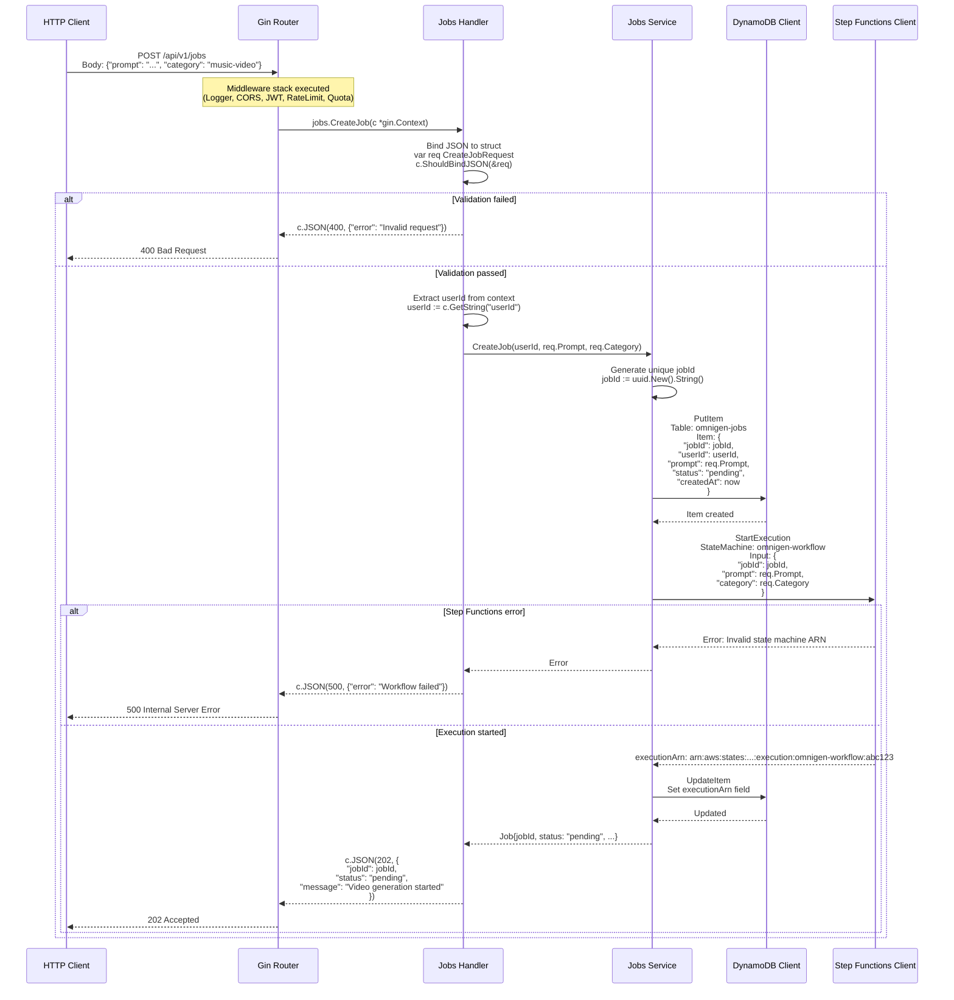

# Backend Architecture

> Go API internal structure, middleware stack, handlers, and AWS SDK integrations

## Overview

The OmniGen backend is a **Go 1.25.4** REST API built with the **Gin web framework**, running on **ECS Fargate** as a containerized application. It provides authentication, job management, and video generation orchestration.

**Key Technologies:**
- **Language:** Go 1.25.4
- **Framework:** Gin (HTTP router)
- **Runtime:** ECS Fargate (1 vCPU, 2 GB RAM)
- **Container:** Docker (multi-stage build, scratch base)
- **Cloud SDKs:** AWS SDK for Go v2

**API Endpoints:**
- `GET /api/v1/health` - Health check (ALB target)
- `POST /api/v1/auth/login` - Cognito OAuth2 redirect
- `GET /api/v1/auth/callback` - OAuth2 callback
- `GET /api/v1/jobs` - List user's jobs
- `POST /api/v1/jobs` - Create new video generation job
- `GET /api/v1/jobs/{id}` - Get job status
- `GET /api/v1/jobs/{id}/video` - Get video URL (presigned S3)

---

## Backend Component Architecture

High-level view of the Go API components and their relationships.

```mermaid
flowchart TB
    subgraph Entry[\"Entry Point\"]
        Main[main.go<br/>cmd/api/main.go]
    end

    subgraph Router[\"HTTP Router (Gin)\"]
        GinEngine[Gin Engine<br/>gin.Default]
        Routes[Route Groups<br/>/api/v1/auth<br/>/api/v1/jobs]
    end

    subgraph Middleware[\"Middleware Stack\"]
        Logger[Logger Middleware<br/>Request/Response logging]
        CORS[CORS Middleware<br/>Access-Control headers]
        JWT[JWT Auth Middleware<br/>Token validation]
        RateLimit[Rate Limit Middleware<br/>100 req/min per user]
        Quota[Quota Middleware<br/>DynamoDB usage check]
    end

    subgraph Handlers[\"Route Handlers\"]
        AuthHandler[Auth Handler<br/>internal/api/handlers/auth.go<br/>Login, Callback, Logout]
        JobsHandler[Jobs Handler<br/>internal/api/handlers/jobs.go<br/>Create, List, Get, GetVideo]
        HealthHandler[Health Handler<br/>internal/api/handlers/health.go<br/>GET /health]
    end

    subgraph Services[\"Business Logic\"]
        AuthService[Auth Service<br/>internal/auth/service.go<br/>JWT validation, JWKS fetching]
        JobsService[Jobs Service<br/>internal/jobs/service.go<br/>Job CRUD, status tracking]
        VideoService[Video Service<br/>internal/video/service.go<br/>Step Functions orchestration]
    end

    subgraph AWS_SDK[\"AWS SDK Clients\"]
        CognitoClient[Cognito Client<br/>JWT validation via JWKS]
        DynamoClient[DynamoDB Client<br/>Jobs, Usage tables]
        S3Client[S3 Client<br/>Presigned URLs, uploads]
        SFNClient[Step Functions Client<br/>StartExecution]
        SecretsClient[Secrets Manager<br/>Replicate API key]
    end

    subgraph Config[\"Configuration\"]
        EnvVars[Environment Variables<br/>PORT, AWS_REGION, etc.]
        AWSConfig[AWS Config<br/>Region, Credentials]
    end

    Main --> EnvVars
    Main --> GinEngine

    GinEngine --> Logger
    Logger --> CORS
    CORS --> Routes

    Routes --> JWT
    JWT --> RateLimit
    RateLimit --> Quota
    Quota --> Handlers

    Handlers --> AuthHandler
    Handlers --> JobsHandler
    Handlers --> HealthHandler

    AuthHandler --> AuthService
    JobsHandler --> JobsService
    JobsHandler --> VideoService

    AuthService --> CognitoClient
    JobsService --> DynamoClient
    VideoService --> SFNClient
    VideoService --> DynamoClient

    JobsHandler --> S3Client

    EnvVars --> AWSConfig
    AWSConfig --> AWS_SDK

    style Middleware fill:#f8bbd0,stroke:#c2185b,stroke-width:2px
    style Handlers fill:#e1f5ff,stroke:#0288d1,stroke-width:2px
    style Services fill:#c5e1a5,stroke:#7cb342,stroke-width:2px
    style AWS_SDK fill:#fff9c4,stroke:#f9a825,stroke-width:2px
```

---

## Project Structure

Directory layout of the Go backend codebase.

```mermaid
flowchart TB
    subgraph Root[\"backend/\"]
        direction TB

        CmdDir[cmd/<br/>Application entry points]
        InternalDir[internal/<br/>Private packages]
        PkgDir[pkg/<br/>Public packages future]
        ConfigDir[configs/<br/>Config files]
        DockerFile[Dockerfile<br/>Multi-stage build]
        GoMod[go.mod, go.sum<br/>Dependencies]
    end

    subgraph Cmd[\"cmd/api/\"]
        MainGo[main.go<br/>Entry point, server setup]
    end

    subgraph Internal[\"internal/\"]
        API[api/<br/>HTTP layer]
        Auth[auth/<br/>Authentication]
        Jobs[jobs/<br/>Job management]
        Video[video/<br/>Video orchestration]
        Config[config/<br/>App configuration]
        Middleware[middleware/<br/>HTTP middleware]
        Models[models/<br/>Data structures]
        Utils[utils/<br/>Helpers]
    end

    subgraph API_Dir[\"internal/api/\"]
        Router[router.go<br/>Route registration]
        Handlers[handlers/<br/>Request handlers]
    end

    subgraph Handlers_Dir[\"internal/api/handlers/\"]
        HealthGo[health.go<br/>Health check handler]
        AuthGo[auth.go<br/>OAuth2 handlers]
        JobsGo[jobs.go<br/>Job CRUD handlers]
    end

    subgraph Auth_Dir[\"internal/auth/\"]
        Service[service.go<br/>JWT validation]
        JWKS[jwks.go<br/>JWKS fetching, caching]
        Middleware_Auth[middleware.go<br/>JWT middleware]
    end

    subgraph Jobs_Dir[\"internal/jobs/\"]
        Service_Jobs[service.go<br/>Job CRUD operations]
        Repository[repository.go<br/>DynamoDB operations]
    end

    subgraph Video_Dir[\"internal/video/\"]
        Service_Video[service.go<br/>Step Functions calls]
    end

    subgraph Models_Dir[\"internal/models/\"]
        Job[job.go<br/>Job struct]
        User[user.go<br/>User struct]
        Response[response.go<br/>API responses]
    end

    Root --> Cmd
    Root --> Internal

    Cmd --> MainGo

    Internal --> API
    Internal --> Auth
    Internal --> Jobs
    Internal --> Video
    Internal --> Config
    Internal --> Middleware
    Internal --> Models
    Internal --> Utils

    API --> Router
    API --> Handlers

    Handlers --> HealthGo
    Handlers --> AuthGo
    Handlers --> JobsGo

    Auth --> Service
    Auth --> JWKS
    Auth --> Middleware_Auth

    Jobs --> Service_Jobs
    Jobs --> Repository

    Video --> Service_Video

    Models --> Job
    Models --> User
    Models --> Response

    style Root fill:#e1f5ff,stroke:#0288d1,stroke-width:2px
    style Internal fill:#c5e1a5,stroke:#7cb342,stroke-width:2px
    style Handlers_Dir fill:#fff9c4,stroke:#f9a825,stroke-width:2px
```

---

## Middleware Pipeline

Detailed view of the middleware execution order (see also [Data Flow](./data-flow.md)).

```mermaid
flowchart LR
    Request([HTTP Request]) --> Logger

    subgraph Logger[\"1. Logger Middleware\"]
        LogStart[Log: Method, Path, IP<br/>Start timer]
    end

    Logger --> CORS

    subgraph CORS[\"2. CORS Middleware\"]
        CheckPreflight{OPTIONS<br/>request?}
        SetHeaders[Set CORS Headers<br/>Access-Control-Allow-Origin<br/>Access-Control-Allow-Methods]
        ReturnPreflight([Return 200 OK])
    end

    CheckPreflight -->|Yes| SetHeaders
    SetHeaders --> ReturnPreflight
    CheckPreflight -->|No| JWT

    subgraph JWT[\"3. JWT Auth Middleware\"]
        ExtractToken[Extract Bearer Token<br/>from Authorization header]
        ValidateJWT{Token<br/>valid?}
        FetchJWKS[Fetch JWKS from Cognito<br/>Cache 1 hour]
        VerifySignature[Verify RS256 Signature<br/>Check expiration]
        SetContext[Set Gin Context:<br/>userId, email]
        Return401([Return 401<br/>Unauthorized])
    end

    ExtractToken --> ValidateJWT
    ValidateJWT -->|No token| Return401
    ValidateJWT -->|Yes| FetchJWKS
    FetchJWKS --> VerifySignature
    VerifySignature -->|Invalid| Return401
    VerifySignature -->|Valid| SetContext
    SetContext --> RateLimit

    subgraph RateLimit[\"4. Rate Limit Middleware\"]
        GetUserId[Get userId from context]
        CheckCounter{Counter > 100<br/>in last min?}
        IncrementCounter[Increment in-memory counter<br/>Key: userId<br/>Window: 60s sliding]
        Return429A([Return 429<br/>Too Many Requests])
    end

    GetUserId --> CheckCounter
    CheckCounter -->|Yes| Return429A
    CheckCounter -->|No| IncrementCounter
    IncrementCounter --> Quota

    subgraph Quota[\"5. Quota Middleware\"]
        QueryDDB[Query DynamoDB<br/>omnigen-usage table<br/>Key: userId]
        CheckQuota{Quota<br/>remaining?}
        Return429B([Return 429<br/>Quota Exceeded])
    end

    QueryDDB --> CheckQuota
    CheckQuota -->|No| Return429B
    CheckQuota -->|Yes| Handler

    subgraph Handler[\"6. Route Handler\"]
        ExecuteHandler[Execute business logic<br/>jobs.CreateJob<br/>jobs.GetJobs, etc.]
    end

    Handler --> Response

    subgraph Response[\"7. Response\"]
        LogEnd[Log: Status, Duration<br/>Write CloudWatch]
        Return200([Return 200/201/400/500<br/>JSON Response])
    end

    LogEnd --> Return200

    style Logger fill:#c5e1a5,stroke:#7cb342,stroke-width:2px
    style CORS fill:#e1f5ff,stroke:#0288d1,stroke-width:2px
    style JWT fill:#f8bbd0,stroke:#c2185b,stroke-width:3px
    style RateLimit fill:#fff9c4,stroke:#f9a825,stroke-width:2px
    style Quota fill:#fff9c4,stroke:#f9a825,stroke-width:2px
    style Handler fill:#c5e1a5,stroke:#7cb342,stroke-width:2px
```

---

## Handler Architecture

How route handlers interact with services and AWS SDKs.



**Handler Example (Simplified):**
```go
// internal/api/handlers/jobs.go
package handlers

import (
    "net/http"
    "github.com/gin-gonic/gin"
    "omnigen/internal/jobs"
    "omnigen/internal/models"
)

type JobsHandler struct {
    service *jobs.Service
}

func NewJobsHandler(service *jobs.Service) *JobsHandler {
    return &JobsHandler{service: service}
}

type CreateJobRequest struct {
    Prompt   string `json:"prompt" binding:"required,min=10,max=500"`
    Category string `json:"category" binding:"required,oneof=music-video ad-creative"`
}

func (h *JobsHandler) CreateJob(c *gin.Context) {
    // 1. Bind and validate request
    var req CreateJobRequest
    if err := c.ShouldBindJSON(&req); err != nil {
        c.JSON(http.StatusBadRequest, models.ErrorResponse{
            Error: "Invalid request",
            Code:  "INVALID_REQUEST",
        })
        return
    }

    // 2. Get userId from JWT middleware context
    userId, exists := c.Get("userId")
    if !exists {
        c.JSON(http.StatusUnauthorized, models.ErrorResponse{
            Error: "Unauthorized",
            Code:  "UNAUTHORIZED",
        })
        return
    }

    // 3. Call service layer
    job, err := h.service.CreateJob(c.Request.Context(), userId.(string), req.Prompt, req.Category)
    if err != nil {
        // Check error type for proper status code
        switch err {
        case jobs.ErrQuotaExceeded:
            c.JSON(http.StatusTooManyRequests, models.ErrorResponse{
                Error: "Monthly quota exceeded",
                Code:  "QUOTA_EXCEEDED",
            })
        default:
            c.JSON(http.StatusInternalServerError, models.ErrorResponse{
                Error: "Internal server error",
                Code:  "INTERNAL_ERROR",
            })
        }
        return
    }

    // 4. Return success response
    c.JSON(http.StatusAccepted, job)
}
```

---

## AWS SDK Integration

How the backend initializes and uses AWS SDK v2 clients.

```mermaid
flowchart TB
    subgraph Initialization[\"Application Startup\"]
        LoadConfig[Load Config<br/>Environment Variables]
        CreateAWSConfig[Create AWS Config<br/>config.LoadDefaultConfig]
        CreateClients[Initialize SDK Clients]
    end

    subgraph Clients[\"AWS SDK Clients\"]
        DynamoDBClient[DynamoDB Client<br/>dynamodb.NewFromConfig]
        S3Client[S3 Client<br/>s3.NewFromConfig]
        SFNClient[SFN Client<br/>sfn.NewFromConfig]
        SecretsClient[Secrets Client<br/>secretsmanager.NewFromConfig]
    end

    subgraph Services_Layer[\"Service Layer\"]
        JobsService[Jobs Service<br/>Uses DynamoDB, SFN]
        VideoService[Video Service<br/>Uses SFN, S3]
        AuthService[Auth Service<br/>Uses Cognito JWKS]
    end

    subgraph Operations[\"Common Operations\"]
        DDB_Put[DynamoDB PutItem<br/>Create job record]
        DDB_Get[DynamoDB GetItem<br/>Fetch job status]
        DDB_Update[DynamoDB UpdateItem<br/>Update job status]
        DDB_Query[DynamoDB Query<br/>List user's jobs]

        S3_Presign[S3 Presigned URL<br/>Generate download link]
        S3_Put[S3 PutObject<br/>Upload thumbnail]

        SFN_Start[Step Functions StartExecution<br/>Trigger video workflow]

        Secrets_Get[Secrets Manager GetSecretValue<br/>Fetch API keys]
    end

    LoadConfig --> CreateAWSConfig
    CreateAWSConfig --> CreateClients

    CreateClients --> DynamoDBClient
    CreateClients --> S3Client
    CreateClients --> SFNClient
    CreateClients --> SecretsClient

    DynamoDBClient --> JobsService
    S3Client --> VideoService
    SFNClient --> JobsService
    SFNClient --> VideoService

    JobsService --> DDB_Put
    JobsService --> DDB_Get
    JobsService --> DDB_Update
    JobsService --> DDB_Query

    VideoService --> S3_Presign
    VideoService --> S3_Put
    VideoService --> SFN_Start

    SecretsClient -.->|Used by Lambda| Secrets_Get

    style Clients fill:#fff9c4,stroke:#f9a825,stroke-width:2px
    style Services_Layer fill:#c5e1a5,stroke:#7cb342,stroke-width:2px
    style Operations fill:#e1f5ff,stroke:#0288d1,stroke-width:2px
```

**AWS Config Initialization:**
```go
// internal/config/aws.go
package config

import (
    "context"
    "github.com/aws/aws-sdk-go-v2/config"
    "github.com/aws/aws-sdk-go-v2/service/dynamodb"
    "github.com/aws/aws-sdk-go-v2/service/s3"
    "github.com/aws/aws-sdk-go-v2/service/sfn"
)

type AWSClients struct {
    DynamoDB *dynamodb.Client
    S3       *s3.Client
    SFN      *sfn.Client
}

func NewAWSClients(ctx context.Context, region string) (*AWSClients, error) {
    // Load AWS config with region
    cfg, err := config.LoadDefaultConfig(ctx,
        config.WithRegion(region),
    )
    if err != nil {
        return nil, err
    }

    // Initialize clients
    return &AWSClients{
        DynamoDB: dynamodb.NewFromConfig(cfg),
        S3:       s3.NewFromConfig(cfg),
        SFN:      sfn.NewFromConfig(cfg),
    }, nil
}
```

---

## Docker Build Process

Multi-stage Docker build for minimal production image.

```mermaid
flowchart TB
    subgraph Build[\"Stage 1: Build (golang:1.25.4-alpine)\"]
        BuildBase[Base Image: golang:1.25.4-alpine<br/>Size: 300 MB]
        CopyGoMod[COPY go.mod, go.sum<br/>Layer caching for deps]
        DownloadDeps[RUN go mod download<br/>Cache dependencies]
        CopySource[COPY . .<br/>All source code]
        CompileGo[RUN go build -o /app/api<br/>-ldflags='-s -w'<br/>Compile static binary]
        Binary[Output: /app/api<br/>Size: 15 MB]
    end

    subgraph Production[\"Stage 2: Production (scratch)\"]
        ScratchBase[Base Image: scratch<br/>Size: 0 MB empty]
        CopyBinary[COPY --from=build /app/api /api<br/>Only binary, no OS]
        CopyCerts[COPY --from=build /etc/ssl/certs/ca-certificates.crt<br/>SSL certs for HTTPS]
        ExposePort[EXPOSE 8080]
        Entrypoint[ENTRYPOINT /api]
        FinalImage[Final Image<br/>Size: 16 MB]
    end

    BuildBase --> CopyGoMod
    CopyGoMod --> DownloadDeps
    DownloadDeps --> CopySource
    CopySource --> CompileGo
    CompileGo --> Binary

    Binary -.->|Copy to production stage| CopyBinary

    ScratchBase --> CopyBinary
    ScratchBase --> CopyCerts
    CopyBinary --> ExposePort
    CopyCerts --> ExposePort
    ExposePort --> Entrypoint
    Entrypoint --> FinalImage

    style Build fill:#e1f5ff,stroke:#0288d1,stroke-width:2px
    style Production fill:#c8e6c9,stroke:#388e3c,stroke-width:3px
```

**Dockerfile:**
```dockerfile
# backend/Dockerfile

# Stage 1: Build
FROM golang:1.25.4-alpine AS build

# Install build dependencies
RUN apk add --no-cache git ca-certificates

WORKDIR /app

# Copy go.mod and go.sum for dependency caching
COPY go.mod go.sum ./
RUN go mod download

# Copy source code
COPY . .

# Build static binary
RUN CGO_ENABLED=0 GOOS=linux GOARCH=amd64 go build \
    -ldflags='-s -w -extldflags "-static"' \
    -o /app/api \
    ./cmd/api

# Stage 2: Production
FROM scratch

# Copy binary and SSL certs
COPY --from=build /app/api /api
COPY --from=build /etc/ssl/certs/ca-certificates.crt /etc/ssl/certs/

# Expose port
EXPOSE 8080

# Health check (not supported in scratch, done via ALB)
# HEALTHCHECK --interval=30s --timeout=5s CMD ["/api", "health"]

# Run
ENTRYPOINT ["/api"]
```

**Build Optimization:**
- **Layer Caching:** `go.mod` and `go.sum` copied first (rarely change)
- **Static Binary:** `CGO_ENABLED=0` (no C dependencies)
- **Strip Symbols:** `-ldflags='-s -w'` (reduces binary size ~30%)
- **Scratch Base:** Minimal attack surface, no shell, no package manager
- **Image Size:** 16 MB (vs 300+ MB with full Alpine)

**Build Command:**
```bash
docker build -f backend/Dockerfile -t omnigen-api:latest backend/
```

---

## Configuration Management

Environment variables and configuration loading.

```mermaid
flowchart LR
    subgraph Sources[\"Configuration Sources\"]
        EnvVars[Environment Variables<br/>ECS Task Definition]
        TerraformOutputs[Terraform Outputs<br/>Injected at deploy time]
    end

    subgraph Required[\"Required Variables\"]
        PORT[PORT<br/>Default: 8080]
        ENVIRONMENT[ENVIRONMENT<br/>development/production]
        AWS_REGION[AWS_REGION<br/>us-east-1]
        JOB_TABLE[JOB_TABLE<br/>omnigen-jobs]
        USAGE_TABLE[USAGE_TABLE<br/>omnigen-usage]
        ASSETS_BUCKET[ASSETS_BUCKET<br/>omnigen-assets]
        SFN_ARN[STEP_FUNCTIONS_ARN<br/>State machine ARN]
        COGNITO_POOL_ID[COGNITO_USER_POOL_ID]
        COGNITO_CLIENT_ID[COGNITO_CLIENT_ID]
        JWT_ISSUER[JWT_ISSUER<br/>https://cognito-idp...]
    end

    subgraph Optional[\"Optional Variables\"]
        LOG_LEVEL[LOG_LEVEL<br/>Default: info]
        RATE_LIMIT[RATE_LIMIT_PER_MIN<br/>Default: 100]
        QUOTA_PER_MONTH[QUOTA_PER_MONTH<br/>Default: 10]
    end

    subgraph Validation[\"Validation\"]
        LoadEnv[Load from os.Getenv]
        CheckRequired{All required<br/>vars set?}
        ExitError[Exit with error:<br/>Missing required env var]
        CreateConfig[Create Config struct]
    end

    EnvVars --> Required
    TerraformOutputs --> Required
    EnvVars --> Optional

    Required --> LoadEnv
    Optional --> LoadEnv

    LoadEnv --> CheckRequired
    CheckRequired -->|No| ExitError
    CheckRequired -->|Yes| CreateConfig

    CreateConfig --> App[Application Startup]

    style Required fill:#ffcdd2,stroke:#c62828,stroke-width:2px
    style Optional fill:#c5e1a5,stroke:#7cb342,stroke-width:2px
```

**Config Struct:**
```go
// internal/config/config.go
package config

import (
    "fmt"
    "os"
    "strconv"
)

type Config struct {
    // Server
    Port        string
    Environment string

    // AWS
    Region           string
    JobTable         string
    UsageTable       string
    AssetsBucket     string
    StepFunctionsARN string

    // Cognito
    CognitoUserPoolID string
    CognitoClientID   string
    JWTIssuer         string

    // Rate Limiting
    RateLimitPerMin int
    QuotaPerMonth   int

    // Logging
    LogLevel string
}

func Load() (*Config, error) {
    cfg := &Config{
        Port:        getEnv("PORT", "8080"),
        Environment: getEnv("ENVIRONMENT", "development"),

        Region:           mustGetEnv("AWS_REGION"),
        JobTable:         mustGetEnv("JOB_TABLE"),
        UsageTable:       mustGetEnv("USAGE_TABLE"),
        AssetsBucket:     mustGetEnv("ASSETS_BUCKET"),
        StepFunctionsARN: mustGetEnv("STEP_FUNCTIONS_ARN"),

        CognitoUserPoolID: mustGetEnv("COGNITO_USER_POOL_ID"),
        CognitoClientID:   mustGetEnv("COGNITO_CLIENT_ID"),
        JWTIssuer:         mustGetEnv("JWT_ISSUER"),

        RateLimitPerMin: getEnvInt("RATE_LIMIT_PER_MIN", 100),
        QuotaPerMonth:   getEnvInt("QUOTA_PER_MONTH", 10),

        LogLevel: getEnv("LOG_LEVEL", "info"),
    }

    return cfg, nil
}

func getEnv(key, defaultValue string) string {
    if value := os.Getenv(key); value != "" {
        return value
    }
    return defaultValue
}

func mustGetEnv(key string) string {
    value := os.Getenv(key)
    if value == "" {
        panic(fmt.Sprintf("Environment variable %s is required", key))
    }
    return value
}

func getEnvInt(key string, defaultValue int) int {
    if value := os.Getenv(key); value != "" {
        if intValue, err := strconv.Atoi(value); err == nil {
            return intValue
        }
    }
    return defaultValue
}
```

---

## Error Handling

Standardized error handling and response format.

```mermaid
flowchart TB
    Error([Error Occurs])

    Error --> Type{Error Type}

    Type -->|Validation Error| ValidationHandler[400 Bad Request<br/>binding.Error]
    Type -->|Authentication Error| AuthHandler[401 Unauthorized<br/>jwt.Error]
    Type -->|Authorization Error| AuthzHandler[403 Forbidden<br/>permissions.Error]
    Type -->|Not Found Error| NotFoundHandler[404 Not Found<br/>NotFoundError]
    Type -->|Rate Limit Error| RateLimitHandler[429 Too Many Requests<br/>RateLimitError]
    Type -->|AWS SDK Error| AWSHandler{AWS Error Type}
    Type -->|Unexpected Error| UnexpectedHandler[500 Internal Server Error<br/>Generic error]

    AWSHandler -->|ResourceNotFoundException| NotFoundHandler
    AWSHandler -->|ProvisionedThroughputExceededException| ServiceUnavailable[503 Service Unavailable<br/>DynamoDB throttling]
    AWSHandler -->|ThrottlingException| ServiceUnavailable
    AWSHandler -->|Other AWS Error| UnexpectedHandler

    ValidationHandler --> FormatResponse
    AuthHandler --> FormatResponse
    AuthzHandler --> FormatResponse
    NotFoundHandler --> FormatResponse
    RateLimitHandler --> FormatResponse
    ServiceUnavailable --> FormatResponse
    UnexpectedHandler --> LogError[Log Error to CloudWatch<br/>Include stack trace]

    LogError --> FormatResponse

    FormatResponse[Format JSON Response<br/>{<br/>  error: string,<br/>  code: string,<br/>  details: object,<br/>  timestamp: string<br/>}]

    FormatResponse --> Response([Return HTTP Response])

    style ValidationHandler fill:#fff9c4,stroke:#f9a825
    style AuthHandler fill:#ffcdd2,stroke:#c62828
    style RateLimitHandler fill:#fff9c4,stroke:#f9a825
    style UnexpectedHandler fill:#ffcdd2,stroke:#c62828
```

**Error Response Example:**
```json
{
  "error": "Invalid request: prompt is required",
  "code": "VALIDATION_ERROR",
  "details": {
    "field": "prompt",
    "constraint": "required"
  },
  "timestamp": "2024-12-15T10:30:45Z"
}
```

---

## Monitoring and Logging

CloudWatch integration for logs and metrics.

```mermaid
flowchart LR
    subgraph ECS[\"ECS Fargate Task\"]
        API[Go API Application]
        Logs[Stdout/Stderr Logs]
    end

    subgraph CloudWatch[\"CloudWatch\"]
        LogGroup[Log Group<br/>/ecs/omnigen]
        LogStream[Log Stream<br/>task/{taskId}]
        Metrics[Custom Metrics<br/>Namespace: OmniGen]
        Alarms[CloudWatch Alarms]
    end

    subgraph Logs_Content[\"Log Entries\"]
        RequestLog[Request: POST /api/v1/jobs<br/>userId: abc123<br/>IP: 192.168.1.1]
        ResponseLog[Response: 202 Accepted<br/>Duration: 45ms]
        ErrorLog[Error: DynamoDB throttled<br/>Stack trace: ...]
    end

    subgraph Metrics_Content[\"Metrics\"]
        RequestCount[RequestCount<br/>Dimensions: Endpoint, StatusCode]
        RequestDuration[RequestDuration<br/>Unit: Milliseconds]
        ErrorCount[ErrorCount<br/>Dimensions: ErrorType]
        ActiveJobs[ActiveJobs<br/>Gauge metric]
    end

    API --> Logs
    Logs --> LogGroup
    LogGroup --> LogStream
    LogStream --> Logs_Content

    API -.->|PutMetricData| Metrics
    Metrics --> Metrics_Content

    Metrics --> Alarms
    Alarms -.->|SNS| Notifications[Email/Slack<br/>Notifications]

    style CloudWatch fill:#fff9c4,stroke:#f9a825,stroke-width:2px
    style Alarms fill:#ffcdd2,stroke:#c62828,stroke-width:2px
```

**CloudWatch Logs Insights Queries:**

**1. Error rate by endpoint:**
```sql
fields @timestamp, endpoint, statusCode
| filter statusCode >= 400
| stats count() as error_count by endpoint, statusCode
| sort error_count desc
```

**2. Slow requests (>1s):**
```sql
fields @timestamp, endpoint, duration
| filter duration > 1000
| sort duration desc
| limit 20
```

**3. Authentication failures:**
```sql
fields @timestamp, userId, @message
| filter @message like /401 Unauthorized/
| stats count() as auth_failures by userId
```

---

## Dependencies

Go modules used in the backend.

```go
// go.mod
module omnigen/backend

go 1.25

require (
    github.com/gin-gonic/gin v1.10.0
    github.com/aws/aws-sdk-go-v2 v1.30.0
    github.com/aws/aws-sdk-go-v2/config v1.27.0
    github.com/aws/aws-sdk-go-v2/service/dynamodb v1.34.0
    github.com/aws/aws-sdk-go-v2/service/s3 v1.58.0
    github.com/aws/aws-sdk-go-v2/service/sfn v1.29.0
    github.com/aws/aws-sdk-go-v2/service/secretsmanager v1.32.0
    github.com/golang-jwt/jwt/v5 v5.2.1
    github.com/google/uuid v1.6.0
)
```

**Key Libraries:**
- **Gin:** HTTP web framework (fastest Go router)
- **AWS SDK v2:** Official AWS SDK for Go (modern, performant)
- **golang-jwt:** JWT parsing and validation
- **uuid:** Generate unique job IDs

---

**Related Documentation:**
- [Data Flow](./data-flow.md) - Complete request/response flows
- [Authentication Flow](./authentication-flow.md) - JWT validation details
- [CI/CD Pipeline](./cicd-pipeline.md) - Docker build and deployment
