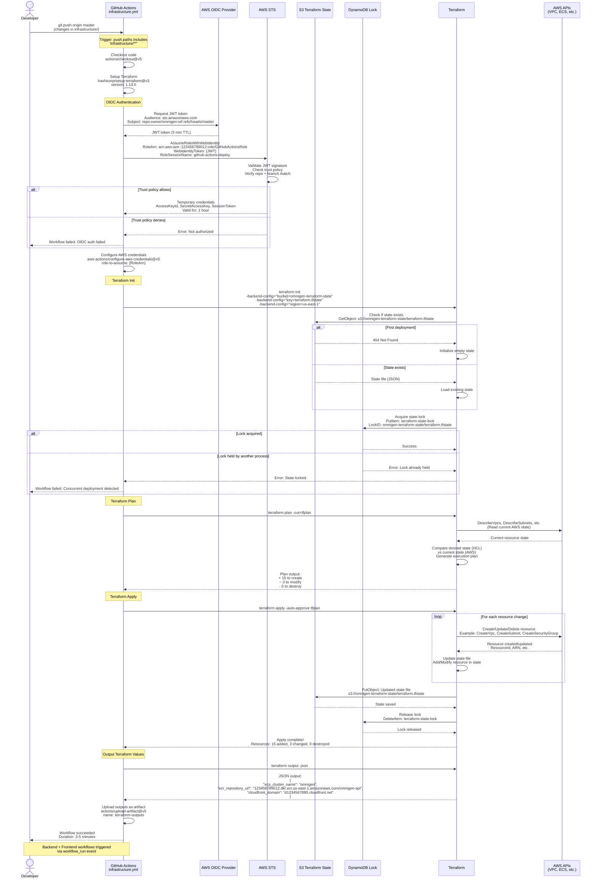
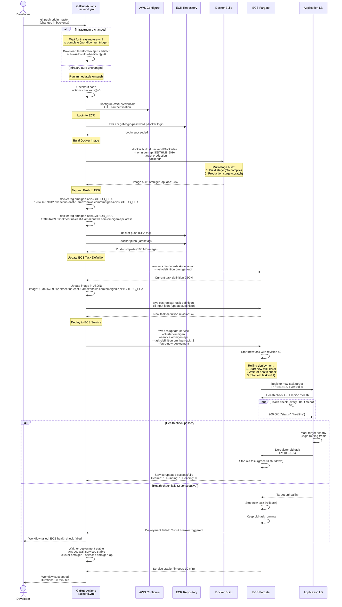
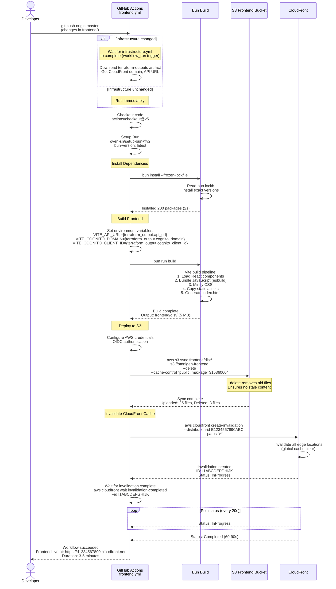
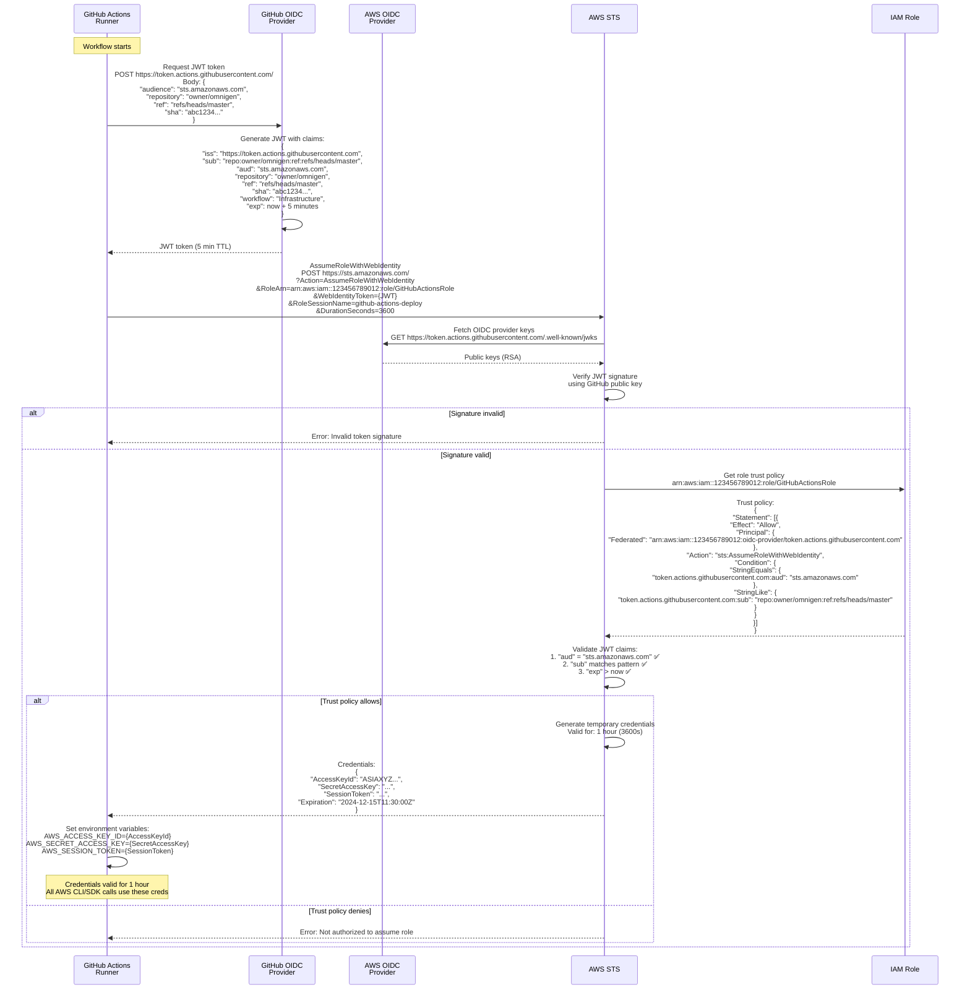
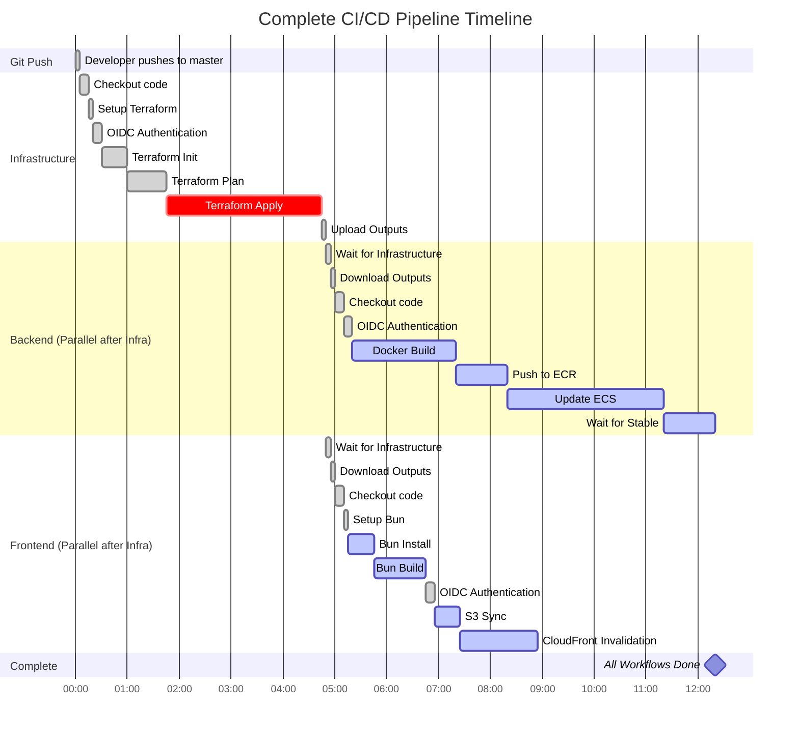

# CI/CD Pipeline

> GitHub Actions workflows for infrastructure, backend, and frontend deployments with OIDC authentication

## Overview

OmniGen uses **GitHub Actions** for continuous deployment with three independent workflows:
1. **Infrastructure** (`infrastructure.yml`) - Terraform deployment of AWS resources
2. **Backend** (`backend.yml`) - Docker build + ECS deployment
3. **Frontend** (`frontend.yml`) - Bun build + S3/CloudFront deployment

**Key Features:**
- **OIDC Authentication:** No long-lived AWS credentials stored in GitHub
- **Workflow Dependencies:** Backend + Frontend wait for infrastructure completion
- **Concurrency Control:** Prevents simultaneous deployments to same environment
- **Path-Based Triggers:** Only deploy what changed
- **Manual Override:** `workflow_dispatch` for on-demand deployments

**Security:**
- AWS credentials valid for 1 hour (STS AssumeRoleWithWebIdentity)
- Terraform state locked via DynamoDB (prevents concurrent modifications)
- No secrets in code (everything via GitHub Secrets)

---

## Complete CI/CD Architecture

High-level view of all workflows and their interactions.

```mermaid
flowchart TB
    subgraph GitHub[\"GitHub Repository\"]
        Code[Source Code<br/>infrastructure/, backend/, frontend/]
        Actions[GitHub Actions<br/>Workflow Runner]
        Secrets[GitHub Secrets<br/>AWS_ROLE_ARN, etc.]
    end

    subgraph OIDC[\"AWS OIDC Provider\"]
        Provider[OIDC Provider<br/>token.actions.githubusercontent.com]
        Role[IAM Role<br/>GitHubActionsRole]
        Trust[Trust Policy<br/>Sub: repo:owner/repo:ref:refs/heads/master]
    end

    subgraph Workflows[\"GitHub Actions Workflows\"]
        Infra[Infrastructure Workflow<br/>infrastructure.yml]
        Backend[Backend Workflow<br/>backend.yml]
        Frontend[Frontend Workflow<br/>frontend.yml]
    end

    subgraph AWS[\"AWS Cloud (us-east-1)\"]
        S3State[S3 Bucket<br/>Terraform State]
        DDBLock[DynamoDB Table<br/>State Lock]

        ECR[ECR Repository<br/>Docker Images]
        ECS[ECS Fargate<br/>API Service]

        S3Frontend[S3 Bucket<br/>Frontend Assets]
        CloudFront[CloudFront<br/>Distribution]

        VPC[VPC + Networking]
        Lambda[Lambda Functions]
        SFN[Step Functions]
        Cognito[Cognito User Pool]
    end

    Code -->|Push to master| Actions
    Actions -->|Trigger| Workflows

    Infra -->|1. Authenticate| Provider
    Backend -->|1. Authenticate| Provider
    Frontend -->|1. Authenticate| Provider

    Provider -->|Verify JWT| Trust
    Trust -->|AssumeRole| Role
    Role -->|Temporary Creds| Infra
    Role -->|Temporary Creds| Backend
    Role -->|Temporary Creds| Frontend

    Infra -->|2. Terraform Init| S3State
    Infra -->|3. Acquire Lock| DDBLock
    Infra -->|4. Terraform Apply| VPC
    Infra -->|Deploy| Lambda
    Infra -->|Deploy| SFN
    Infra -->|Deploy| Cognito

    Backend -->|2. Build Docker| ECR
    Backend -->|3. Deploy| ECS

    Frontend -->|2. Bun Build| S3Frontend
    Frontend -->|3. Invalidate Cache| CloudFront

    Infra -.->|workflow_run trigger| Backend
    Infra -.->|workflow_run trigger| Frontend

    style Workflows fill:#e1f5ff,stroke:#0288d1,stroke-width:2px
    style OIDC fill:#f3e5f5,stroke:#7b1fa2,stroke-width:2px
    style AWS fill:#fff3e0,stroke:#f57c00,stroke-width:2px
```

---

## Infrastructure Workflow

Terraform deployment of all AWS resources.



**Workflow File:** `.github/workflows/infrastructure.yml`

**Key Steps:**
1. **Checkout:** `actions/checkout@v5`
2. **Setup Terraform:** `hashicorp/setup-terraform@v3` (v1.13.5)
3. **Configure AWS:** `aws-actions/configure-aws-credentials@v5` (OIDC)
4. **Terraform Init:** Backend S3 + DynamoDB lock
5. **Terraform Plan:** Generate execution plan
6. **Terraform Apply:** Deploy resources (auto-approve)
7. **Upload Outputs:** Save as artifact for dependent workflows

**Triggers:**
```yaml
on:
  push:
    branches: [master]
    paths:
      - 'infrastructure/**'
      - '.github/workflows/infrastructure.yml'
  workflow_dispatch:  # Manual trigger
```

**Concurrency:**
```yaml
concurrency:
  group: infrastructure-deploy
  cancel-in-progress: false  # Don't cancel running deployments
```

---

## Backend Workflow

Docker build and ECS deployment.



**Workflow File:** `.github/workflows/backend.yml`

**Key Steps:**
1. **Wait for Infrastructure:** `workflow_run` trigger (if infra changed)
2. **Checkout:** `actions/checkout@v5`
3. **Configure AWS:** OIDC authentication
4. **ECR Login:** `docker login` via AWS CLI
5. **Build Docker Image:** Multi-stage build (Go compile → scratch)
6. **Push to ECR:** Tag with `$GITHUB_SHA` and `latest`
7. **Update Task Definition:** New revision with updated image
8. **Deploy to ECS:** Rolling update with circuit breaker
9. **Wait for Stable:** Health checks must pass

**Triggers:**
```yaml
on:
  push:
    branches: [master]
    paths:
      - 'backend/**'
      - '.github/workflows/backend.yml'
  workflow_run:
    workflows: ["Infrastructure"]
    types: [completed]
    branches: [master]
  workflow_dispatch:
```

**Health Check Configuration:**
```yaml
Health Check Path: /api/v1/health
Health Check Interval: 30 seconds
Health Check Timeout: 5 seconds
Healthy Threshold: 2 consecutive successes
Unhealthy Threshold: 2 consecutive failures
```

**Circuit Breaker:**
- **Enabled:** Prevents bad deployments from taking down service
- **Rollback Trigger:** 2 failed health checks
- **Behavior:** Stops new task, keeps old task running

---

## Frontend Workflow

Bun build and S3/CloudFront deployment.



**Workflow File:** `.github/workflows/frontend.yml`

**Key Steps:**
1. **Wait for Infrastructure:** `workflow_run` trigger
2. **Checkout:** `actions/checkout@v5`
3. **Setup Bun:** `oven-sh/setup-bun@v2`
4. **Install Dependencies:** `bun install --frozen-lockfile`
5. **Build:** `bun run build` (Vite + React)
6. **Configure AWS:** OIDC authentication
7. **Sync to S3:** `aws s3 sync` with `--delete` flag
8. **Invalidate CloudFront:** Clear global edge cache
9. **Wait for Invalidation:** Ensure fresh content served

**Triggers:**
```yaml
on:
  push:
    branches: [master]
    paths:
      - 'frontend/**'
      - '.github/workflows/frontend.yml'
  workflow_run:
    workflows: ["Infrastructure"]
    types: [completed]
    branches: [master]
  workflow_dispatch:
```

**S3 Sync Configuration:**
```bash
--delete              # Remove files not in source
--cache-control "public, max-age=31536000"  # 1 year cache for assets
--exclude "*.html"    # Don't cache HTML (needs fresh content)
```

**CloudFront Invalidation:**
- **Paths:** `/*` (invalidate everything)
- **Cost:** First 1,000 invalidations/month free, then $0.005 per path
- **Duration:** 60-90 seconds (global edge cache clear)

---

## OIDC Authentication Flow

Detailed view of GitHub Actions OIDC authentication with AWS.



**OIDC Provider Configuration (Terraform):**
```hcl
# infrastructure/github-oidc/main.tf
resource "aws_iam_openid_connect_provider" "github" {
  url = "https://token.actions.githubusercontent.com"
  client_id_list = ["sts.amazonaws.com"]
  thumbprint_list = [
    "6938fd4d98bab03faadb97b34396831e3780aea1",  # GitHub OIDC thumbprint
    "1c58a3a8518e8759bf075b76b750d4f2df264fcd"   # Backup thumbprint
  ]
}

resource "aws_iam_role" "github_actions" {
  name = "GitHubActionsRole"

  assume_role_policy = jsonencode({
    Version = "2012-10-17"
    Statement = [{
      Effect = "Allow"
      Principal = {
        Federated = aws_iam_openid_connect_provider.github.arn
      }
      Action = "sts:AssumeRoleWithWebIdentity"
      Condition = {
        StringEquals = {
          "token.actions.githubusercontent.com:aud" = "sts.amazonaws.com"
        }
        StringLike = {
          "token.actions.githubusercontent.com:sub" = "repo:owner/omnigen:ref:refs/heads/master"
        }
      }
    }]
  })
}

resource "aws_iam_role_policy_attachment" "github_actions_admin" {
  role       = aws_iam_role.github_actions.name
  policy_arn = "arn:aws:iam::aws:policy/AdministratorAccess"  # MVP only
}
```

**Security Benefits:**
- No long-lived AWS credentials in GitHub Secrets
- Credentials auto-rotate every deployment
- Credentials expire after 1 hour
- Fine-grained access control via IAM role
- Audit trail via CloudTrail (all STS AssumeRole calls logged)

---

## Deployment Timeline

Gantt chart showing all workflows and their dependencies.



**Total Deployment Time:**
- **Infrastructure Only:** ~5 minutes
- **Backend After Infra:** ~8 minutes
- **Frontend After Infra:** ~4 minutes
- **Complete Pipeline (all changed):** ~13 minutes (infra sequential, then backend + frontend parallel)

---

## Concurrency Control

How workflows prevent simultaneous deployments.

```yaml
# infrastructure.yml
concurrency:
  group: infrastructure-deploy
  cancel-in-progress: false  # Don't cancel running deployments

# backend.yml
concurrency:
  group: backend-deploy-${{ github.ref }}
  cancel-in-progress: true  # Cancel older deployments (safe for stateless app)

# frontend.yml
concurrency:
  group: frontend-deploy-${{ github.ref }}
  cancel-in-progress: true  # Cancel older deployments (safe for static assets)
```

**Behavior:**
- **Infrastructure:** Never cancel (could leave Terraform state locked)
- **Backend/Frontend:** Cancel older runs (latest code wins)
- **Per-Branch:** Each branch has independent concurrency group

**Example Scenario:**
1. Developer pushes commit A (starts workflow A)
2. 2 minutes later, pushes commit B (starts workflow B)
3. **Infrastructure:** Workflow A completes, then workflow B runs
4. **Backend:** Workflow A canceled, workflow B runs immediately
5. **Frontend:** Workflow A canceled, workflow B runs immediately

---

## Monitoring and Notifications

### GitHub Actions Status

**Workflow Status Page:**
- View at: `https://github.com/owner/omnigen/actions`
- Shows: All workflow runs, duration, logs, artifacts
- Filters: By workflow, branch, event type

**Logs:**
- **Persistent:** 90 days retention
- **Downloadable:** Full logs as ZIP
- **Real-time:** Live tail during execution

### Notifications

**GitHub Notifications:**
- Email on workflow failure (default)
- Slack integration (via GitHub Apps)
- Discord webhook (custom)

**AWS Notifications (Future):**
- SNS topic for deployment events
- CloudWatch alarms for ECS service unhealthy

---

## Troubleshooting

### Common Issues

**1. OIDC Authentication Failed**
```
Error: Not authorized to assume role
Causes:
- Trust policy doesn't match repo/branch
- OIDC provider thumbprint outdated
- IAM role deleted
Solution: Verify trust policy in infrastructure/github-oidc/main.tf
```

**2. Terraform State Locked**
```
Error: Error acquiring the state lock
Causes:
- Previous workflow failed mid-apply
- Concurrent deployment attempted
Solution: Manually release lock:
  aws dynamodb delete-item \
    --table-name terraform-state-lock \
    --key '{"LockID": {"S": "omnigen-terraform-state/terraform.tfstate"}}'
```

**3. ECS Health Check Failed**
```
Error: Circuit breaker triggered, rolling back
Causes:
- Backend code crashes on startup
- Health endpoint not responding
- Security group blocking ALB → ECS
Solution: Check ECS logs in CloudWatch, verify health endpoint
```

**4. CloudFront Cache Not Invalidated**
```
Error: Old content still served
Causes:
- Invalidation not waited for
- Cache-Control headers too aggressive
Solution: Wait for invalidation complete, adjust cache headers
```

---

## Cost Analysis

### GitHub Actions

**Free Tier:**
- 2,000 minutes/month (public repos unlimited)
- 500 MB storage (artifacts, logs, caches)

**Usage:**
- **Infrastructure:** ~5 min/run
- **Backend:** ~8 min/run
- **Frontend:** ~4 min/run
- **Total per deployment:** ~17 minutes

**Estimated Monthly Cost:**
- 20 deployments/month x 17 min = 340 minutes
- Well under free tier (2,000 min)
- **Cost: $0/month**

### AWS (CI/CD Related)

| Service | Usage | Cost |
|---------|-------|------|
| **S3 (Terraform State)** | <1 GB storage, 100 requests/month | $0.03 |
| **DynamoDB (State Lock)** | On-demand, ~100 writes/month | $0.001 |
| **CloudFront (Invalidations)** | 20/month x 1 path = 20 | $0.00 (first 1,000 free) |
| **ECR (Docker Images)** | 5 GB storage, 100 pushes/month | $0.50 |
| **TOTAL** | | **$0.53/month** |

---

**Related Documentation:**
- [Architecture Overview](./architecture-overview.md) - System design
- [Backend Architecture](./backend-architecture.md) - Docker build details
- [Infrastructure Modules](./infrastructure-modules.md) - Terraform structure
