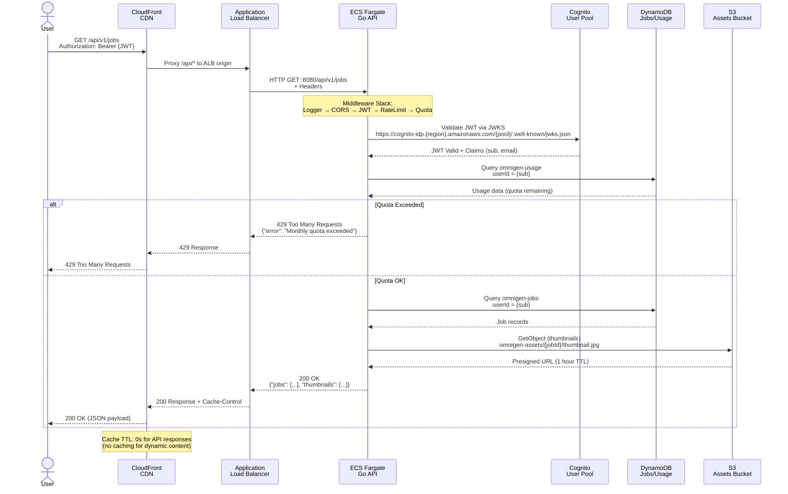
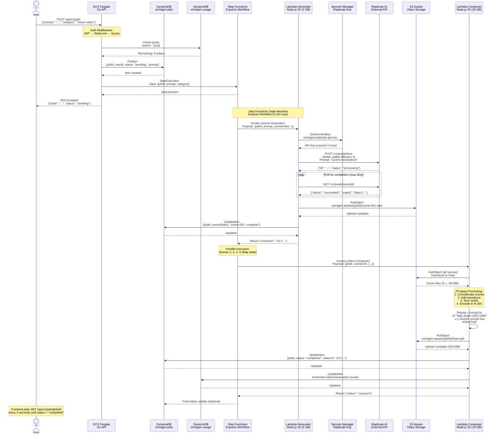
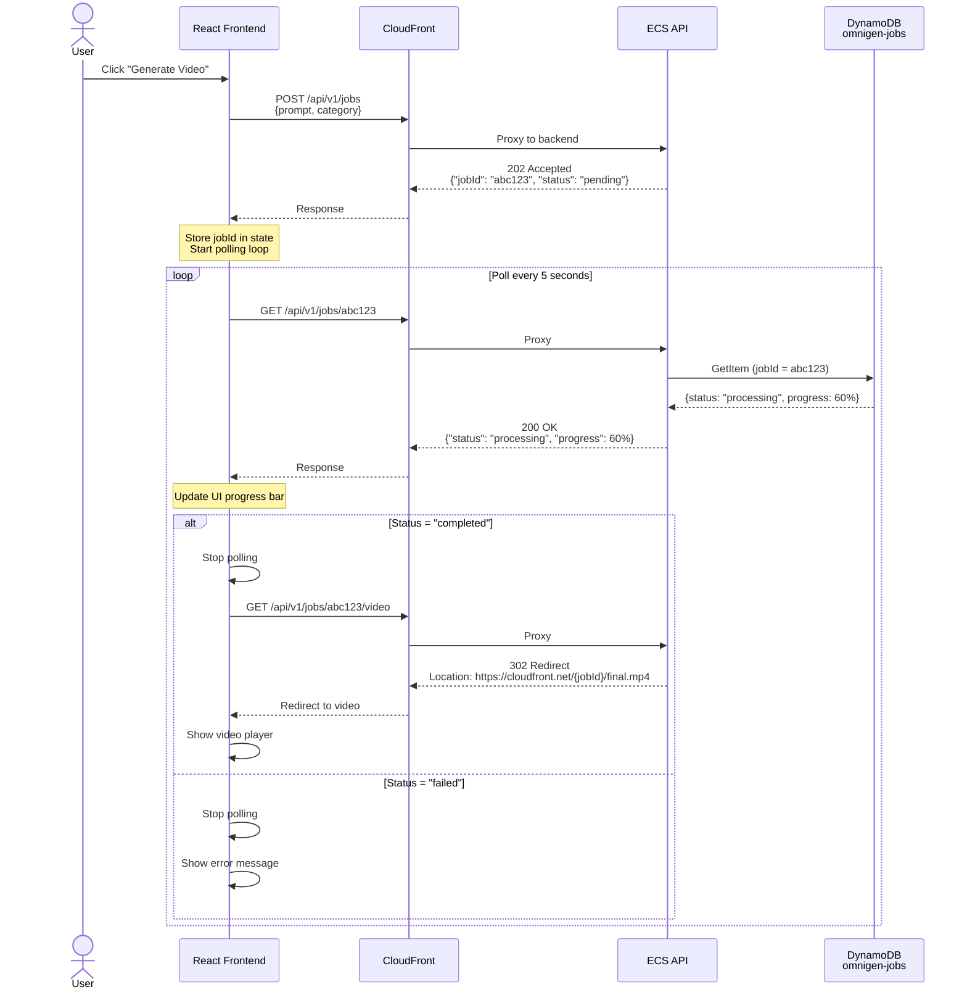
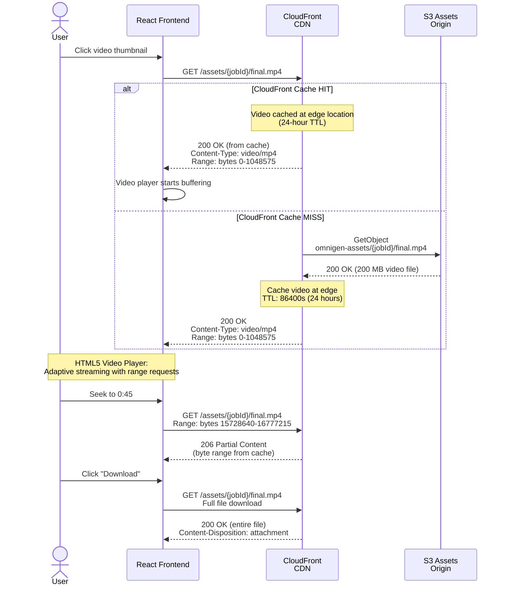
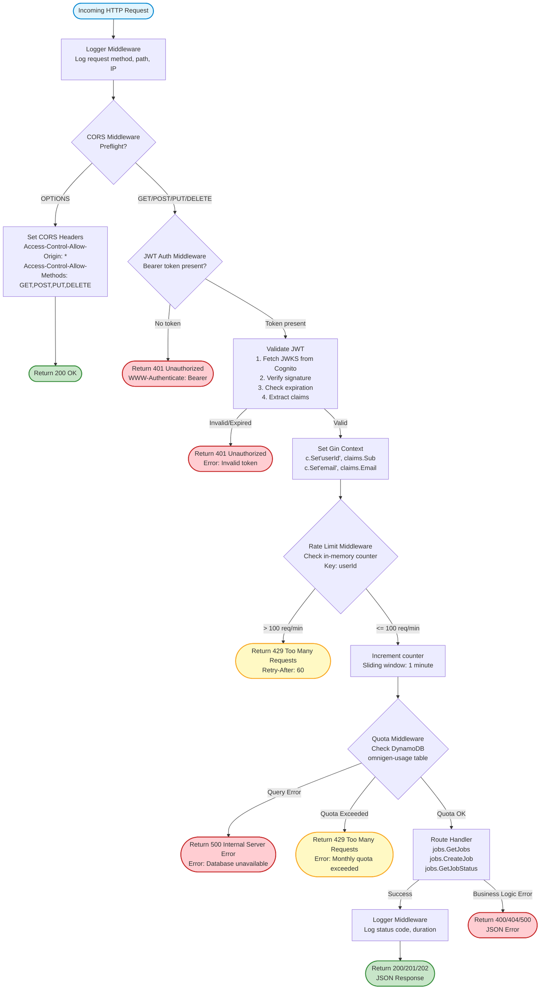

# Data Flow Diagrams

> End-to-end request/response flows through the OmniGen platform

## Overview

This document maps complete data flows from user browser through CloudFront, ALB, ECS, and backend services. All diagrams are derived from actual infrastructure code and backend implementation.

**Key Flows Documented:**
1. API Request Flow (REST endpoints)
2. Video Generation Flow (Step Functions orchestration)
3. Job Status Polling (WebSocket alternative)
4. Video Playback Flow (CloudFront + S3)
5. Middleware Stack (Go API request pipeline)

---

## API Request Flow

This sequence shows a standard authenticated API request from frontend to backend.



**Key Points:**
- **CloudFront Routing:** `/api/*` paths bypass CloudFront cache and proxy to ALB
- **JWT Validation:** JWKS fetched on startup, cached in-memory for 1 hour
- **Rate Limiting:** 100 requests per user per minute (in-memory counter)
- **Quota Enforcement:** DynamoDB query on every request (on-demand billing)
- **S3 URLs:** Presigned URLs with 1-hour expiration for security

---

## Video Generation Flow

This sequence shows the complete video generation pipeline from API request to final video output.



**Performance Metrics:**
- **Scene Generation:** 30-60s per scene (Replicate API latency)
- **Parallel Scenes:** 5 scenes in ~60s (Map state parallelism)
- **Video Composition:** 30-90s (FFmpeg encoding)
- **Total Time:** 2-3 minutes for 30-second video

**Cost Breakdown (30-second video):**
- Step Functions Express: $0.000025 per execution = $0.000025
- Lambda Generator: 5 invocations x 60s x 2048 MB = $0.01
- Lambda Composer: 1 invocation x 90s x 10240 MB = $0.01
- DynamoDB: 10 write requests = $0.0000125
- S3: 200 MB storage + PUT = $0.005
- Replicate API: $1.30 (5 scenes x $0.26)
- **Total: $1.32/video**

---

## Job Status Polling

Lightweight polling mechanism for frontend to track job progress (WebSocket alternative).



**Polling Configuration:**
- **Interval:** 5 seconds (balance between UX and API load)
- **Timeout:** 5 minutes (Step Functions max execution time)
- **Retry Logic:** Exponential backoff on 5xx errors
- **Cache Headers:** `Cache-Control: no-store, must-revalidate`

**Alternative (Future):** WebSocket via API Gateway for real-time updates

---

## Video Playback Flow

This sequence shows how generated videos are delivered to end users via CloudFront.



**CloudFront Configuration:**
- **Cache Behavior:** `/assets/*` → S3 origin
- **TTL:** 24 hours for videos (immutable content)
- **Compression:** Gzip disabled for video files (already compressed)
- **Range Requests:** Enabled for video seeking
- **CORS:** Allowed for cross-origin requests

**Performance:**
- **First Byte:** <100ms (CloudFront edge)
- **Throughput:** 10-100 Mbps (depends on user location)
- **Availability:** 99.9% (CloudFront SLA)

---

## Middleware Stack Flow

This flowchart shows the Go API middleware pipeline that every request passes through.



**Middleware Execution Order:**

1. **Logger (Pre-Handler)**
   - Logs: `[GIN] 2024-12-15 10:30:45 | 200 | 45ms | 192.168.1.1 | GET /api/v1/jobs`
   - Writes to: CloudWatch Logs `/ecs/omnigen`

2. **CORS (Preflight Handler)**
   - Handles: `OPTIONS` requests from browser
   - Headers: `Access-Control-Allow-Origin: *` (MVP - should restrict to CloudFront domain in prod)

3. **JWT Auth (Security)**
   - JWKS URL: `https://cognito-idp.us-east-1.amazonaws.com/{userPoolId}/.well-known/jwks.json`
   - Cache: JWKS cached in-memory for 1 hour
   - Claims: `sub` (userId), `email`, `cognito:username`

4. **Rate Limit (Abuse Prevention)**
   - Algorithm: Sliding window counter (in-memory map)
   - Limit: 100 requests per user per minute
   - Reset: Automatic after 1 minute
   - Storage: In-memory (resets on ECS task restart)

5. **Quota Enforcement (Billing)**
   - Storage: DynamoDB `omnigen-usage` table
   - Quota: 10 videos per user per month (MVP)
   - Counter: Incremented on successful video completion
   - Reset: Monthly cron job (Lambda function)

6. **Handler (Business Logic)**
   - Routes: Gin router with groups
   - Validation: Request body validation with `binding:"required"`
   - Errors: Standardized JSON error responses

7. **Logger (Post-Handler)**
   - Logs: Response status, duration, error messages
   - Metrics: CloudWatch custom metrics (request count, latency)

---

## Error Handling

### Error Response Format

All API errors follow this JSON structure:

```json
{
  "error": "Human-readable error message",
  "code": "ERROR_CODE_CONSTANT",
  "details": {
    "field": "Additional context"
  },
  "timestamp": "2024-12-15T10:30:45Z"
}
```

### Common Error Scenarios

```mermaid
flowchart LR
    subgraph Client[\"Client Errors (4xx)\"]
        E400[400 Bad Request<br/>Invalid JSON, missing fields]
        E401[401 Unauthorized<br/>Missing/invalid JWT]
        E403[403 Forbidden<br/>Valid JWT, insufficient permissions]
        E404[404 Not Found<br/>Job ID not found]
        E429[429 Too Many Requests<br/>Rate limit or quota exceeded]
    end

    subgraph Server[\"Server Errors (5xx)\"]
        E500[500 Internal Server Error<br/>Unhandled exception]
        E502[502 Bad Gateway<br/>ECS task unhealthy]
        E503[503 Service Unavailable<br/>DynamoDB throttling]
        E504[504 Gateway Timeout<br/>Lambda timeout > 900s]
    end

    style Client fill:#fff9c4,stroke:#f9a825
    style Server fill:#ffcdd2,stroke:#c62828
```

---

## Data Flow Summary

| Flow Type | Latency | Cost (per request) | Caching |
|-----------|---------|-------------------|---------|
| **API Request** | 50-200ms | $0.0001 | No (dynamic) |
| **Video Generation** | 2-3 min | $1.32 | N/A |
| **Status Polling** | 50-100ms | $0.00005 | No |
| **Video Playback** | <100ms | $0.01/GB | Yes (24h) |
| **Middleware** | 5-10ms | $0 (included) | JWKS (1h) |

**Bottlenecks:**
1. **Replicate API:** 30-60s per scene (external dependency)
2. **Lambda Cold Start:** 1-3s for first invocation (mitigated with provisioned concurrency)
3. **FFmpeg Encoding:** 30-90s (CPU-bound, cannot optimize further without hardware encoding)

**Optimizations Applied:**
- JWKS caching (1 hour) to reduce Cognito API calls
- Presigned S3 URLs (1 hour TTL) to offload traffic from API
- CloudFront caching for static assets and videos
- DynamoDB on-demand billing to handle bursty traffic
- Step Functions Express for cost-effective orchestration

---

**Related Documentation:**
- [Architecture Overview](./architecture-overview.md) - High-level system design
- [Network Topology](./network-topology.md) - VPC and routing details
- [Authentication Flow](./authentication-flow.md) - Cognito OAuth2/JWT deep dive
- [Video Workflow](./video-workflow.md) - Step Functions state machine
