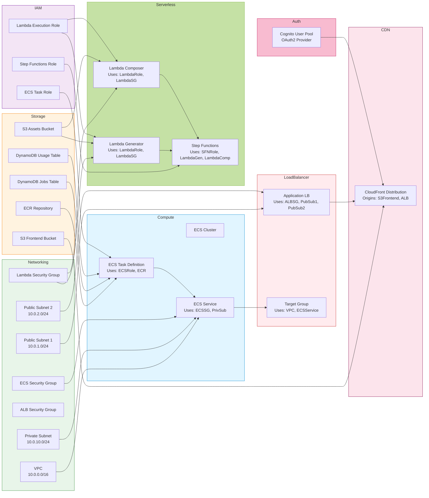
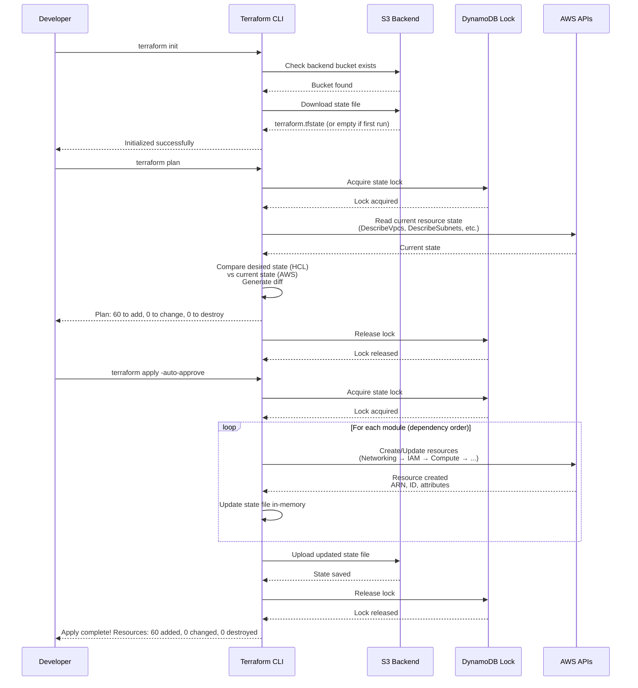

# Infrastructure Modules

> Terraform module structure, relationships, and deployment dependencies

## Overview

The OmniGen infrastructure is organized into **9 Terraform modules**, each managing a specific layer of the AWS architecture. This modular design enables independent testing, reusability, and clear separation of concerns.

**Infrastructure Directory:**
```
infrastructure/
├── main.tf                 # Root module (orchestrates all modules)
├── variables.tf            # Input variables
├── outputs.tf              # Output values
├── terraform.tf            # Backend configuration (S3 + DynamoDB)
├── terraform.tfvars        # Variable values (gitignored)
├── github-oidc/            # Separate: OIDC provider setup
└── modules/
    ├── networking/         # VPC, subnets, security groups
    ├── compute/            # ECS cluster, task definitions
    ├── serverless/         # Lambda functions, Step Functions
    ├── storage/            # S3 buckets, DynamoDB tables
    ├── loadbalancer/       # ALB, target groups, listeners
    ├── cdn/                # CloudFront distribution
    ├── auth/               # Cognito User Pool
    ├── iam/                # IAM roles and policies
    └── monitoring/         # CloudWatch logs, metrics
```

**Terraform Version:** >= 1.13.5
**AWS Provider:** ~> 6.21

---

## Module Dependency Graph

Shows deployment order and dependencies between modules.

```mermaid
flowchart TB
    subgraph Layer1[\"Layer 1: Foundation (No Dependencies)\"]
        Networking[Networking Module<br/>VPC, Subnets, SGs<br/>vpc.tf, subnets.tf, security-groups.tf]
        Monitoring[Monitoring Module<br/>CloudWatch Log Groups<br/>cloudwatch.tf]
        IAM[IAM Module<br/>Roles, Policies<br/>roles.tf, policies.tf]
        Storage[Storage Module<br/>S3, DynamoDB<br/>s3.tf, dynamodb.tf]
    end

    subgraph Layer2[\"Layer 2: Compute & Auth (Depends on Layer 1)\"]
        Compute[Compute Module<br/>ECS, ECR<br/>ecs.tf, ecr.tf]
        Serverless[Serverless Module<br/>Lambda, Step Functions<br/>lambda.tf, stepfunctions.tf]
        Auth[Auth Module<br/>Cognito User Pool<br/>cognito.tf]
    end

    subgraph Layer3[\"Layer 3: Networking Services (Depends on Layer 2)\"]
        LoadBalancer[Load Balancer Module<br/>ALB, Target Group<br/>alb.tf]
        CDN[CDN Module<br/>CloudFront<br/>cloudfront.tf]
    end

    Networking --> Compute
    Networking --> Serverless
    Networking --> LoadBalancer
    IAM --> Compute
    IAM --> Serverless
    Storage --> Serverless
    Monitoring --> Compute
    Monitoring --> Serverless

    Compute --> LoadBalancer
    Storage --> CDN
    Auth --> CDN

    LoadBalancer --> CDN

    style Layer1 fill:#c8e6c9,stroke:#388e3c,stroke-width:3px
    style Layer2 fill:#fff9c4,stroke:#f9a825,stroke-width:3px
    style Layer3 fill:#e1f5ff,stroke:#0288d1,stroke-width:3px
```

**Deployment Order:**
1. **Layer 1 (Parallel):** Networking, IAM, Storage, Monitoring
2. **Layer 2 (After Layer 1):** Compute, Serverless, Auth
3. **Layer 3 (After Layer 2):** LoadBalancer, CDN

**Total Deployment Time:** ~5 minutes (Terraform parallelizes where possible)

---

## Module Relationships

Detailed view of how modules reference each other's outputs.



---

## Module Details

### 1. Networking Module

**Purpose:** VPC, subnets, security groups, NAT Gateway, VPC endpoints

**Files:**
- `vpc.tf` - VPC, Internet Gateway
- `subnets.tf` - Public (2 AZs), Private (1 AZ)
- `nat.tf` - NAT Gateway, Elastic IP
- `security-groups.tf` - ALB-SG, ECS-SG, Lambda-SG, VPCE-SG
- `vpc-endpoints.tf` - S3 Gateway, DynamoDB Gateway, ECR Interface
- `outputs.tf` - VPC ID, subnet IDs, SG IDs

**Key Resources:**
```hcl
resource "aws_vpc" "main" {
  cidr_block           = "10.0.0.0/16"
  enable_dns_hostnames = true
  enable_dns_support   = true
  tags = { Name = "omnigen-vpc" }
}

resource "aws_subnet" "public_1" {
  vpc_id                  = aws_vpc.main.id
  cidr_block              = "10.0.1.0/24"
  availability_zone       = "us-east-1a"
  map_public_ip_on_launch = true
}

resource "aws_security_group" "alb" {
  vpc_id = aws_vpc.main.id
  ingress {
    from_port   = 80
    to_port     = 80
    protocol    = "tcp"
    cidr_blocks = ["0.0.0.0/0"]
  }
  egress {
    from_port       = 8080
    to_port         = 8080
    protocol        = "tcp"
    security_groups = [aws_security_group.ecs.id]
  }
}
```

**Outputs Used By:**
- Compute (ECS subnets, security groups)
- Serverless (Lambda subnets, security groups)
- LoadBalancer (ALB subnets, security groups)

**Cost:** $47.90/month (NAT Gateway $32.40, VPC Endpoints $14.40, Elastic IP $1.10)

---

### 2. Storage Module

**Purpose:** S3 buckets, DynamoDB tables, ECR repository

**Files:**
- `s3.tf` - Assets bucket, Frontend bucket
- `dynamodb.tf` - Jobs table, Usage table
- `ecr.tf` - Docker repository
- `outputs.tf` - Bucket names, table names, ECR URL

**Key Resources:**
```hcl
resource "aws_s3_bucket" "assets" {
  bucket = "omnigen-assets"
  tags   = { Purpose = "Video storage" }
}

resource "aws_s3_bucket_versioning" "assets" {
  bucket = aws_s3_bucket.assets.id
  versioning_configuration {
    status = "Disabled"  # MVP: No versioning to save costs
  }
}

resource "aws_dynamodb_table" "jobs" {
  name           = "omnigen-jobs"
  billing_mode   = "PAY_PER_REQUEST"  # On-demand
  hash_key       = "jobId"
  attribute {
    name = "jobId"
    type = "S"
  }
  attribute {
    name = "userId"
    type = "S"
  }
  global_secondary_index {
    name            = "UserIdIndex"
    hash_key        = "userId"
    projection_type = "ALL"
  }
}

resource "aws_ecr_repository" "api" {
  name                 = "omnigen-api"
  image_tag_mutability = "MUTABLE"
  image_scanning_configuration {
    scan_on_push = true  # Security: Scan for vulnerabilities
  }
}
```

**Outputs Used By:**
- Compute (ECR repository URL)
- Serverless (S3 bucket names)
- IAM (S3/DynamoDB ARNs for policies)
- CDN (S3 frontend bucket)

**Cost:** $0.73/month (S3 $0.23, DynamoDB $0, ECR $0.50)

---

### 3. IAM Module

**Purpose:** IAM roles and policies for ECS, Lambda, Step Functions

**Files:**
- `roles.tf` - ECS task role, Lambda execution role, SFN role
- `policies.tf` - Inline and managed policies
- `outputs.tf` - Role ARNs

**Key Resources:**
```hcl
resource "aws_iam_role" "ecs_task" {
  name = "omnigen-ecs-task-role"
  assume_role_policy = jsonencode({
    Version = "2012-10-17"
    Statement = [{
      Effect = "Allow"
      Principal = { Service = "ecs-tasks.amazonaws.com" }
      Action = "sts:AssumeRole"
    }]
  })
}

resource "aws_iam_role_policy" "ecs_task" {
  role = aws_iam_role.ecs_task.id
  policy = jsonencode({
    Version = "2012-10-17"
    Statement = [
      {
        Effect = "Allow"
        Action = ["dynamodb:GetItem", "dynamodb:PutItem", "dynamodb:UpdateItem", "dynamodb:Query"]
        Resource = [
          var.jobs_table_arn,
          "${var.jobs_table_arn}/index/*",
          var.usage_table_arn
        ]
      },
      {
        Effect = "Allow"
        Action = ["s3:GetObject", "s3:PutObject"]
        Resource = "${var.assets_bucket_arn}/*"
      },
      {
        Effect = "Allow"
        Action = ["states:StartExecution"]
        Resource = var.step_functions_arn
      }
    ]
  })
}
```

**Outputs Used By:**
- Compute (ECS task role ARN)
- Serverless (Lambda execution role ARN, SFN role ARN)

**Cost:** $0/month (IAM is free)

---

### 4. Compute Module

**Purpose:** ECS Fargate cluster, task definition, service, ECR

**Files:**
- `ecs.tf` - Cluster, task definition, service
- `ecr.tf` - Docker repository (moved to storage module)
- `autoscaling.tf` - Auto-scaling policies
- `outputs.tf` - Cluster name, service ARN

**Key Resources:**
```hcl
resource "aws_ecs_cluster" "main" {
  name = "omnigen"
  setting {
    name  = "containerInsights"
    value = "enabled"
  }
}

resource "aws_ecs_task_definition" "api" {
  family                   = "omnigen-api"
  network_mode             = "awsvpc"
  requires_compatibilities = ["FARGATE"]
  cpu                      = "1024"  # 1 vCPU
  memory                   = "2048"  # 2 GB
  execution_role_arn       = var.ecs_execution_role_arn
  task_role_arn            = var.ecs_task_role_arn

  container_definitions = jsonencode([{
    name  = "api"
    image = "${var.ecr_repository_url}:latest"
    portMappings = [{
      containerPort = 8080
      protocol      = "tcp"
    }]
    environment = [
      { name = "PORT", value = "8080" },
      { name = "ENVIRONMENT", value = "production" },
      { name = "AWS_REGION", value = var.region },
      { name = "JOB_TABLE", value = var.jobs_table_name },
      { name = "USAGE_TABLE", value = var.usage_table_name },
      { name = "ASSETS_BUCKET", value = var.assets_bucket_name },
      { name = "STEP_FUNCTIONS_ARN", value = var.step_functions_arn }
    ]
    logConfiguration = {
      logDriver = "awslogs"
      options = {
        "awslogs-group"         = var.log_group_name
        "awslogs-region"        = var.region
        "awslogs-stream-prefix" = "api"
      }
    }
  }])
}

resource "aws_ecs_service" "api" {
  name            = "omnigen-api"
  cluster         = aws_ecs_cluster.main.id
  task_definition = aws_ecs_task_definition.api.arn
  desired_count   = 1
  launch_type     = "FARGATE"

  network_configuration {
    subnets          = var.private_subnet_ids
    security_groups  = [var.ecs_security_group_id]
    assign_public_ip = false
  }

  load_balancer {
    target_group_arn = var.target_group_arn
    container_name   = "api"
    container_port   = 8080
  }

  deployment_circuit_breaker {
    enable   = true
    rollback = true
  }

  depends_on = [var.alb_listener_arn]
}
```

**Outputs Used By:**
- LoadBalancer (ECS service for target group)

**Cost:** $35.04/month (ECS Fargate 1 vCPU, 2 GB, 24/7)

---

### 5. Serverless Module

**Purpose:** Lambda functions, Step Functions state machine

**Files:**
- `lambda.tf` - Generator and Composer Lambdas
- `stepfunctions.tf` - State machine definition
- `outputs.tf` - Lambda ARNs, SFN ARN

**Key Resources:**
```hcl
resource "aws_lambda_function" "generator" {
  function_name = "omnigen-generator"
  role          = var.lambda_execution_role_arn
  handler       = "index.handler"
  runtime       = "nodejs20.x"
  filename      = "lambda/generator.zip"
  memory_size   = 2048
  timeout       = 900  # 15 minutes

  environment {
    variables = {
      REPLICATE_SECRET_ARN = var.replicate_secret_arn
      ASSETS_BUCKET        = var.assets_bucket_name
      REGION               = var.region
    }
  }

  vpc_config {
    subnet_ids         = var.private_subnet_ids
    security_group_ids = [var.lambda_security_group_id]
  }
}

resource "aws_sfn_state_machine" "workflow" {
  name     = "omnigen-workflow"
  role_arn = var.sfn_execution_role_arn
  type     = "EXPRESS"

  definition = jsonencode({
    Comment = "OmniGen video generation workflow"
    StartAt = "GenerateScenes"
    States = {
      GenerateScenes = {
        Type           = "Map"
        ItemsPath      = "$.scenes"
        MaxConcurrency = 5
        Iterator = {
          StartAt = "GenerateScene"
          States = {
            GenerateScene = {
              Type     = "Task"
              Resource = aws_lambda_function.generator.arn
              Retry = [{
                ErrorEquals     = ["Replicate.APIError"]
                IntervalSeconds = 5
                MaxAttempts     = 3
                BackoffRate     = 2.0
              }]
              End = true
            }
          }
        }
        ResultPath = "$.sceneResults"
        Next       = "ComposeVideo"
      }
      ComposeVideo = {
        Type     = "Task"
        Resource = aws_lambda_function.composer.arn
        End      = true
      }
    }
  })

  logging_configuration {
    log_destination        = "${var.log_group_arn}:*"
    include_execution_data = true
    level                  = "ALL"
  }
}
```

**Outputs Used By:**
- Compute (SFN ARN for ECS task environment)

**Cost:** $0.01/month idle (pay per invocation)

---

### 6. LoadBalancer Module

**Purpose:** Application Load Balancer, target group, HTTP listener

**Files:**
- `alb.tf` - ALB, listeners, target group
- `outputs.tf` - ALB DNS name, target group ARN

**Key Resources:**
```hcl
resource "aws_lb" "main" {
  name               = "omnigen-alb"
  internal           = false
  load_balancer_type = "application"
  security_groups    = [var.alb_security_group_id]
  subnets            = var.public_subnet_ids

  enable_deletion_protection = false  # MVP: Allow deletion
  enable_http2               = true
}

resource "aws_lb_target_group" "ecs" {
  name        = "omnigen-ecs-tg"
  port        = 8080
  protocol    = "HTTP"
  vpc_id      = var.vpc_id
  target_type = "ip"  # Required for Fargate

  health_check {
    path                = "/api/v1/health"
    interval            = 30
    timeout             = 5
    healthy_threshold   = 2
    unhealthy_threshold = 2
    matcher             = "200"
  }

  deregistration_delay = 30  # Graceful shutdown
}

resource "aws_lb_listener" "http" {
  load_balancer_arn = aws_lb.main.arn
  port              = 80
  protocol          = "HTTP"

  default_action {
    type             = "forward"
    target_group_arn = aws_lb_target_group.ecs.arn
  }
}
```

**Outputs Used By:**
- CDN (ALB DNS name as origin)

**Cost:** $16.20/month (ALB base cost)

---

### 7. Auth Module

**Purpose:** Cognito User Pool, app client, hosted UI

**Files:**
- `cognito.tf` - User pool, client, domain
- `outputs.tf` - User pool ID, client ID, domain

**Key Resources:**
```hcl
resource "aws_cognito_user_pool" "main" {
  name = "omnigen-users"

  password_policy {
    minimum_length    = 8
    require_lowercase = true
    require_uppercase = true
    require_numbers   = true
    require_symbols   = true
  }

  auto_verified_attributes = ["email"]

  schema {
    name                = "email"
    attribute_data_type = "String"
    required            = true
    mutable             = true
  }
}

resource "aws_cognito_user_pool_client" "frontend" {
  name         = "omnigen-frontend"
  user_pool_id = aws_cognito_user_pool.main.id

  allowed_oauth_flows                  = ["code"]
  allowed_oauth_scopes                 = ["openid", "email", "profile"]
  allowed_oauth_flows_user_pool_client = true
  callback_urls                        = ["https://${var.cloudfront_domain}/callback"]
  logout_urls                          = ["https://${var.cloudfront_domain}/logout"]

  supported_identity_providers = ["COGNITO"]
}

resource "aws_cognito_user_pool_domain" "main" {
  domain       = "omnigen-${random_string.suffix.result}"
  user_pool_id = aws_cognito_user_pool.main.id
}
```

**Outputs Used By:**
- Compute (Cognito pool ID for ECS task environment)
- CDN (Cognito domain for frontend config)

**Cost:** $0/month (<50K MAU free tier)

---

### 8. CDN Module

**Purpose:** CloudFront distribution, cache behaviors

**Files:**
- `cloudfront.tf` - Distribution, origins, behaviors
- `outputs.tf` - CloudFront domain

**Key Resources:**
```hcl
resource "aws_cloudfront_distribution" "main" {
  enabled = true
  comment = "OmniGen CDN"

  origin {
    domain_name = var.s3_frontend_bucket_regional_domain
    origin_id   = "S3-Frontend"
    s3_origin_config {
      origin_access_identity = aws_cloudfront_origin_access_identity.main.cloudfront_access_identity_path
    }
  }

  origin {
    domain_name = var.alb_dns_name
    origin_id   = "ALB-Backend"
    custom_origin_config {
      http_port              = 80
      https_port             = 443
      origin_protocol_policy = "http-only"  # ALB is HTTP
      origin_ssl_protocols   = ["TLSv1.2"]
    }
  }

  default_cache_behavior {
    target_origin_id       = "S3-Frontend"
    viewer_protocol_policy = "redirect-to-https"
    allowed_methods        = ["GET", "HEAD", "OPTIONS"]
    cached_methods         = ["GET", "HEAD"]

    forwarded_values {
      query_string = false
      cookies { forward = "none" }
    }

    min_ttl     = 0
    default_ttl = 86400  # 24 hours
    max_ttl     = 31536000  # 1 year
  }

  ordered_cache_behavior {
    path_pattern           = "/api/*"
    target_origin_id       = "ALB-Backend"
    viewer_protocol_policy = "https-only"
    allowed_methods        = ["GET", "HEAD", "OPTIONS", "PUT", "POST", "PATCH", "DELETE"]
    cached_methods         = ["GET", "HEAD"]

    forwarded_values {
      query_string = true
      headers      = ["Authorization", "Origin"]
      cookies { forward = "all" }
    }

    min_ttl     = 0
    default_ttl = 0  # No caching for API
    max_ttl     = 0
  }

  restrictions {
    geo_restriction { restriction_type = "none" }
  }

  viewer_certificate {
    cloudfront_default_certificate = true  # MVP: Use default cert
  }
}
```

**Outputs Used By:**
- Auth (CloudFront domain for Cognito callback URLs)

**Cost:** $0.85/month (10 GB transfer)

---

### 9. Monitoring Module

**Purpose:** CloudWatch log groups, Container Insights

**Files:**
- `cloudwatch.tf` - Log groups for ECS, Lambda, SFN
- `outputs.tf` - Log group ARNs

**Key Resources:**
```hcl
resource "aws_cloudwatch_log_group" "ecs" {
  name              = "/ecs/omnigen"
  retention_in_days = 7  # MVP: 7 days (production: 90 days)
}

resource "aws_cloudwatch_log_group" "lambda_generator" {
  name              = "/aws/lambda/omnigen-generator"
  retention_in_days = 7
}

resource "aws_cloudwatch_log_group" "sfn" {
  name              = "/aws/states/omnigen-workflow"
  retention_in_days = 7
}
```

**Outputs Used By:**
- Compute (ECS task definition log configuration)
- Serverless (Lambda log destination)

**Cost:** $0.53/month (1 GB logs)

---

## Terraform Root Module

The root `main.tf` orchestrates all modules.

```mermaid
flowchart TB
    Main[main.tf<br/>Root Module] --> Networking
    Main --> Storage
    Main --> IAM
    Main --> Monitoring

    Main --> Compute
    Main --> Serverless
    Main --> Auth

    Main --> LoadBalancer
    Main --> CDN

    subgraph Module_Calls[\"Module Calls\"]
        Networking[module.networking]
        Storage[module.storage]
        IAM[module.iam]
        Monitoring[module.monitoring]
        Compute[module.compute]
        Serverless[module.serverless]
        Auth[module.auth]
        LoadBalancer[module.loadbalancer]
        CDN[module.cdn]
    end

    style Main fill:#e1f5ff,stroke:#0288d1,stroke-width:3px
    style Module_Calls fill:#c5e1a5,stroke:#7cb342,stroke-width:2px
```

**Example: Root Module Calling Networking Module**
```hcl
# infrastructure/main.tf
module "networking" {
  source = "./modules/networking"

  vpc_cidr             = var.vpc_cidr
  public_subnet_cidrs  = var.public_subnet_cidrs
  private_subnet_cidrs = var.private_subnet_cidrs
  availability_zones   = var.availability_zones
  environment          = var.environment
  project_name         = var.project_name
}

module "compute" {
  source = "./modules/compute"

  # Networking outputs
  vpc_id               = module.networking.vpc_id
  private_subnet_ids   = module.networking.private_subnet_ids
  ecs_security_group_id = module.networking.ecs_security_group_id

  # Storage outputs
  ecr_repository_url = module.storage.ecr_repository_url
  jobs_table_name    = module.storage.jobs_table_name

  # IAM outputs
  ecs_task_role_arn = module.iam.ecs_task_role_arn

  # Other variables
  environment  = var.environment
  project_name = var.project_name
}
```

---

## Terraform Backend Configuration

S3 backend with DynamoDB state locking.

```hcl
# infrastructure/terraform.tf
terraform {
  required_version = ">= 1.13.5"

  required_providers {
    aws = {
      source  = "hashicorp/aws"
      version = "~> 6.21"
    }
    random = {
      source  = "hashicorp/random"
      version = "~> 3.6"
    }
  }

  backend "s3" {
    bucket         = "omnigen-terraform-state"
    key            = "terraform.tfstate"
    region         = "us-east-1"
    encrypt        = true
    dynamodb_table = "terraform-state-lock"
  }
}

provider "aws" {
  region = var.region

  default_tags {
    tags = {
      Project     = "omnigen"
      Environment = var.environment
      ManagedBy   = "terraform"
    }
  }
}
```

**Backend Resources (Separate Stack):**
```hcl
# infrastructure/backend/main.tf
resource "aws_s3_bucket" "terraform_state" {
  bucket = "omnigen-terraform-state"
}

resource "aws_s3_bucket_versioning" "terraform_state" {
  bucket = aws_s3_bucket.terraform_state.id
  versioning_configuration {
    status = "Enabled"
  }
}

resource "aws_dynamodb_table" "terraform_state_lock" {
  name         = "terraform-state-lock"
  billing_mode = "PAY_PER_REQUEST"
  hash_key     = "LockID"

  attribute {
    name = "LockID"
    type = "S"
  }
}
```

---

## Deployment Workflow

Complete Terraform deployment process.



---

## Module Testing (Future)

Best practices for testing Terraform modules.

```mermaid
flowchart TB
    subgraph Test[\"Testing Strategy\"]
        Unit[Unit Tests<br/>Terratest Go tests]
        Integration[Integration Tests<br/>Deploy to test AWS account]
        Validation[Validation<br/>terraform validate, fmt, tflint]
    end

    subgraph Tools[\"Testing Tools\"]
        Terratest[Terratest<br/>Go testing framework]
        TFLint[TFLint<br/>Linter for Terraform]
        TFSec[TFSec<br/>Security scanner]
        Checkov[Checkov<br/>Policy-as-code]
    end

    Validation --> Terratest
    Unit --> Terratest
    Integration --> Terratest

    Validation --> TFLint
    Validation --> TFSec
    Validation --> Checkov

    style Test fill:#c5e1a5,stroke:#7cb342,stroke-width:2px
    style Tools fill:#fff9c4,stroke:#f9a825,stroke-width:2px
```

**Example: Terratest for Networking Module**
```go
// infrastructure/modules/networking/test/networking_test.go
package test

import (
    "testing"
    "github.com/gruntwork-io/terratest/modules/terraform"
    "github.com/stretchr/testify/assert"
)

func TestNetworkingModule(t *testing.T) {
    terraformOptions := &terraform.Options{
        TerraformDir: "../",
        Vars: map[string]interface{}{
            "vpc_cidr": "10.0.0.0/16",
            "environment": "test",
        },
    }

    defer terraform.Destroy(t, terraformOptions)
    terraform.InitAndApply(t, terraformOptions)

    vpcId := terraform.Output(t, terraformOptions, "vpc_id")
    assert.NotEmpty(t, vpcId)
}
```

---

## Best Practices

### Module Design

1. **Single Responsibility:** Each module manages one AWS service layer
2. **Clear Inputs/Outputs:** Well-defined variables and outputs
3. **No Hardcoded Values:** Use variables for all configurable values
4. **Documentation:** README.md in each module explaining purpose, inputs, outputs
5. **Versioning:** Use Git tags for module versions (future: Terraform Registry)

### State Management

1. **Remote Backend:** Always use S3 + DynamoDB (never local state)
2. **State Locking:** DynamoDB prevents concurrent modifications
3. **State Encryption:** Enable S3 encryption at rest
4. **State Versioning:** Enable S3 versioning for rollback capability

### Security

1. **IAM Least Privilege:** Minimal permissions in policies
2. **No Secrets in Code:** Use Secrets Manager, never hardcode
3. **Default Tags:** Apply consistent tags to all resources
4. **Resource Deletion Protection:** Enable for production (disabled in MVP)

---

**Related Documentation:**
- [Architecture Overview](./architecture-overview.md) - High-level system design
- [CI/CD Pipeline](./cicd-pipeline.md) - Terraform deployment workflow
- [Network Topology](./network-topology.md) - VPC architecture details
