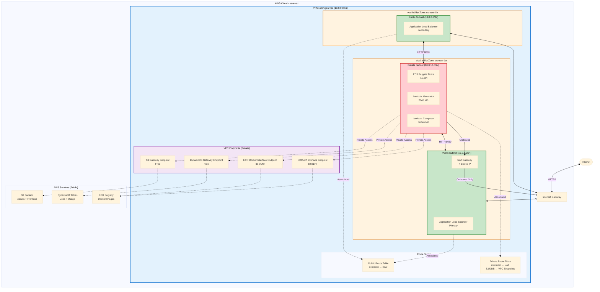
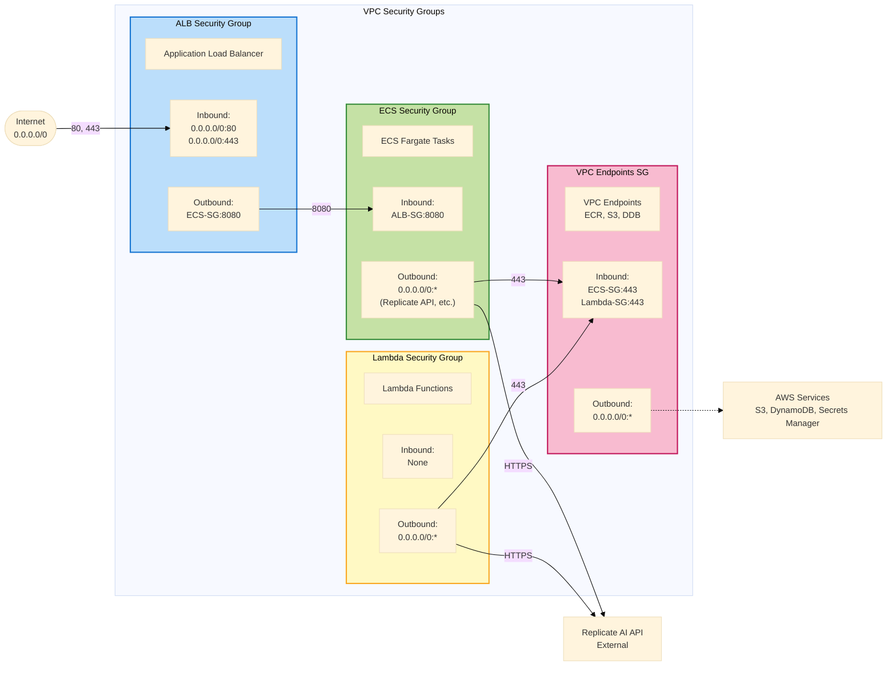
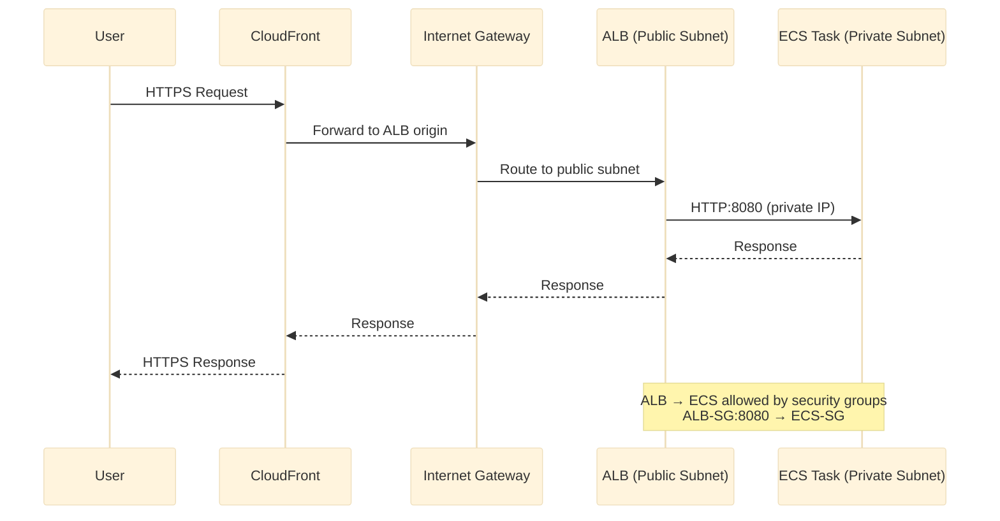
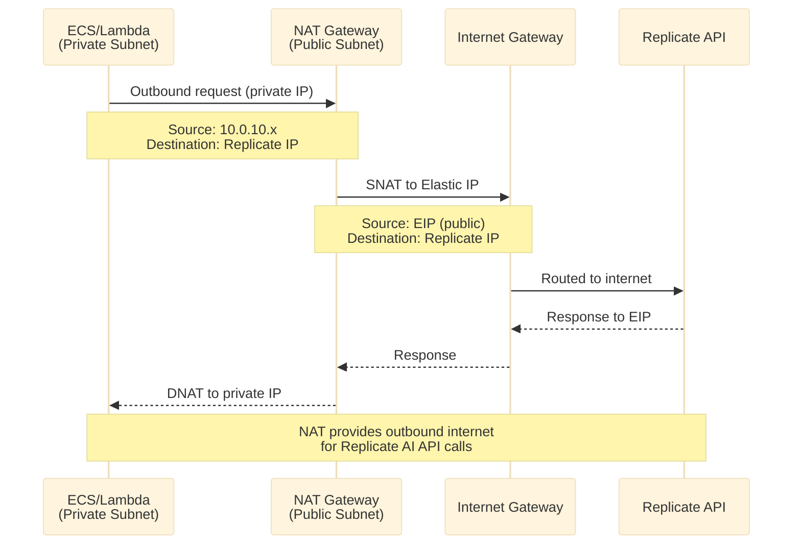
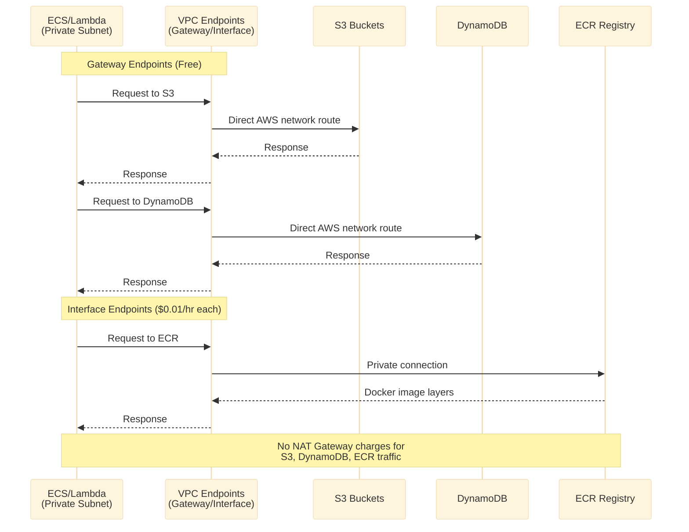
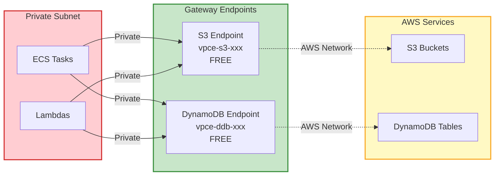
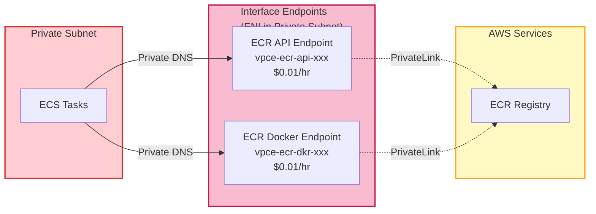

# Network Topology

> Detailed VPC architecture, subnets, security groups, routing, and VPC endpoints

## VPC Architecture Overview

---

## Security Groups Architecture

---

## Traffic Flow Patterns

### Inbound User Traffic

### Outbound Internet Traffic (from Private Subnet)

### VPC Endpoint Traffic (Cost-Optimized)

---

## IP Address Allocation

| Subnet | CIDR | Available IPs | Reserved | Usable | Purpose |
|--------|------|---------------|----------|--------|---------|
| **VPC** | 10.0.0.0/16 | 65,536 | 5 (AWS) | 65,531 | Total address space |
| **Public (us-east-1a)** | 10.0.1.0/24 | 256 | 5 | 251 | ALB, NAT Gateway |
| **Public (us-east-1b)** | 10.0.2.0/24 | 256 | 5 | 251 | ALB (multi-AZ) |
| **Private (us-east-1a)** | 10.0.10.0/24 | 256 | 5 | 251 | ECS tasks, Lambdas |

**Reserved IPs per Subnet (AWS):**
- `.0` - Network address
- `.1` - VPC router
- `.2` - DNS server
- `.3` - Future use
- `.255` - Broadcast address

---

## Routing Configuration

### Public Route Table

| Destination | Target | Purpose |
|-------------|--------|---------|
| 10.0.0.0/16 | local | VPC internal traffic |
| 0.0.0.0/0 | igw-xxx | Internet access |

**Associated Subnets:**
- 10.0.1.0/24 (us-east-1a public)
- 10.0.2.0/24 (us-east-1b public)

---

### Private Route Table

| Destination | Target | Purpose |
|-------------|--------|---------|
| 10.0.0.0/16 | local | VPC internal traffic |
| 0.0.0.0/0 | nat-xxx | Outbound internet via NAT |
| s3.us-east-1 | vpce-s3-xxx | S3 via gateway endpoint |
| dynamodb.us-east-1 | vpce-ddb-xxx | DynamoDB via gateway endpoint |

**Associated Subnets:**
- 10.0.10.0/24 (us-east-1a private)

---

## VPC Endpoints Details

### Gateway Endpoints (No Hourly Cost)

**S3 Gateway Endpoint:**
- Prefix List: pl-63a5400a (us-east-1)
- Route added automatically to route table
- No data transfer charges within same region

**DynamoDB Gateway Endpoint:**
- Prefix List: pl-02cd2c6b (us-east-1)
- Route added automatically to route table
- No data transfer charges

---

### Interface Endpoints ($0.01/hour each)

**ECR API Endpoint (com.amazonaws.us-east-1.ecr.api):**
- Private DNS: Yes
- Cost: $0.01/hour = $7.20/month
- Data transfer: $0.01/GB
- Purpose: ECR API calls (list images, describe repositories)

**ECR Docker Endpoint (com.amazonaws.us-east-1.ecr.dkr):**
- Private DNS: Yes
- Cost: $0.01/hour = $7.20/month
- Data transfer: $0.01/GB
- Purpose: Docker pull/push operations

**Total Interface Endpoint Cost:** $14.40/month

---

## Network Cost Optimization

### Current Architecture Costs

| Component | Monthly Cost | Annual Cost |
|-----------|-------------|-------------|
| NAT Gateway (730 hrs) | $32.85 | $394.20 |
| NAT Data Processing (10 GB) | $0.45 | $5.40 |
| Interface Endpoints (2 × 730 hrs) | $14.60 | $175.20 |
| **Total Networking** | **$47.90** | **$574.80** |

---

### Cost Savings from VPC Endpoints

**Without VPC Endpoints:**
- S3 traffic via NAT: 100 GB/month × $0.045/GB = $4.50
- DynamoDB traffic via NAT: 50 GB/month × $0.045/GB = $2.25
- **Total NAT savings:** $6.75/month

**With Gateway Endpoints (Free):**
- S3 traffic: $0
- DynamoDB traffic: $0
- **Savings:** $6.75/month = $81/year

**Interface Endpoint ROI:**
- ECR data transfer savings: ~5 GB/month × $0.045 = $0.23
- Cost: $14.40/month
- **Net cost:** -$14.17/month (worth it for security & performance)

---

## Network Performance

### Latency Characteristics

| Path | Typical Latency | Notes |
|------|----------------|-------|
| User → CloudFront | 10-50ms | Edge location proximity |
| CloudFront → ALB | 5-15ms | AWS network |
| ALB → ECS | <1ms | Same VPC |
| ECS → DynamoDB (VPC Endpoint) | 1-3ms | AWS PrivateLink |
| ECS → S3 (VPC Endpoint) | 1-3ms | AWS PrivateLink |
| ECS → Replicate (via NAT) | 50-200ms | Internet latency |

---

### Throughput Limits

| Component | Limit | Notes |
|-----------|-------|-------|
| NAT Gateway | 45 Gbps | Scales automatically |
| VPC Endpoints (Gateway) | High throughput | No hard limit |
| VPC Endpoints (Interface) | 10 Gbps | Per ENI |
| Internet Gateway | No limit | AWS managed |

---

## High Availability Considerations

### Current Setup

**Multi-AZ:**
- ✅ ALB spans 2 AZs (us-east-1a, us-east-1b)
- ✅ Public subnets in 2 AZs

**Single-AZ (Cost Optimization):**
- ⚠️ Private subnet in 1 AZ (us-east-1a)
- ⚠️ NAT Gateway in 1 AZ
- ⚠️ ECS tasks in 1 AZ

**Impact of AZ Failure:**
- us-east-1a failure: ECS tasks down, NAT unavailable, ~2-5 min recovery
- us-east-1b failure: ALB continues on us-east-1a, no impact

---

### Production Upgrade Path

To achieve full high availability:

1. **Add Second Private Subnet**
   - Create 10.0.11.0/24 in us-east-1b
   - Cost: $0 (subnet is free)

2. **Add Second NAT Gateway**
   - Deploy NAT in us-east-1b public subnet
   - Cost: +$32.85/month
   - Benefit: AZ-independent outbound internet

3. **Update ECS Service**
   - Change subnet configuration to include both AZs
   - ECS auto-distributes tasks across AZs
   - Cost: $0 (same number of tasks)

**Total HA Upgrade Cost:** +$32.85/month for second NAT

---

## Security Best Practices

### Implemented

✅ Private subnets for all compute (ECS, Lambda)
✅ Security groups with least-privilege rules
✅ VPC endpoints for AWS service access (no internet exposure)
✅ NAT Gateway for controlled outbound access
✅ No public IPs on ECS tasks or Lambdas
✅ CloudFront HTTPS enforcement

### Recommended Additions

- [ ] Enable VPC Flow Logs (CloudWatch Logs)
- [ ] Implement AWS WAF on ALB/CloudFront
- [ ] Add Network ACLs for defense-in-depth
- [ ] Enable GuardDuty for threat detection
- [ ] Implement AWS Shield Standard (free) or Advanced

---

**Related Documentation:**
- [Architecture Overview](./architecture-overview.md) - High-level system design
- [Data Flow](./data-flow.md) - Request/response sequences
- [Infrastructure Modules](./infrastructure-modules.md) - Terraform structure
