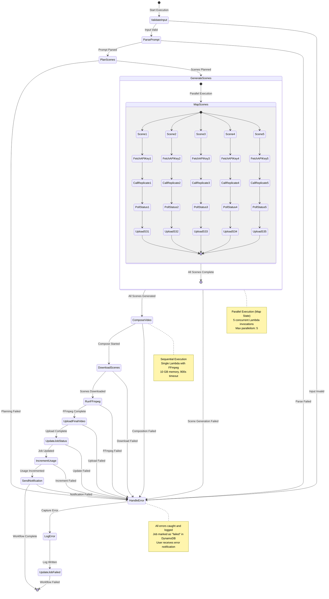
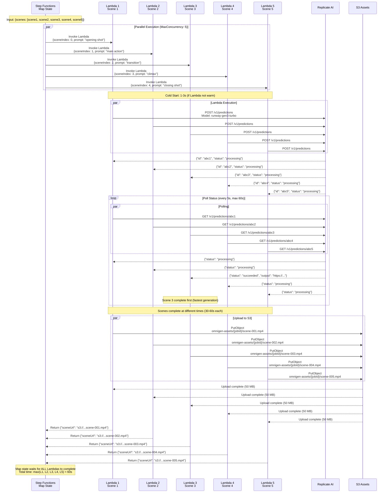
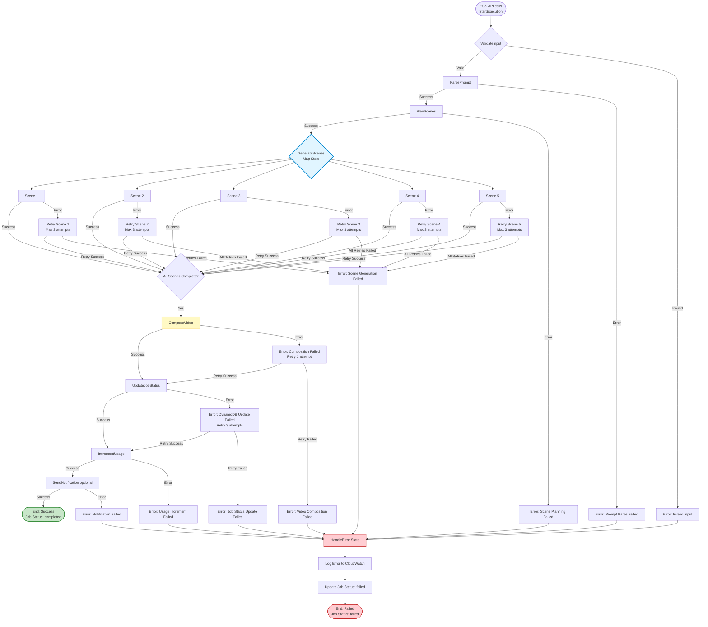

# Video Generation Workflow

> Step Functions Express state machine orchestrating Lambda-based video generation pipeline

## Overview

The video generation pipeline uses **AWS Step Functions Express** to orchestrate a multi-stage workflow:
1. **Scene Generation** (parallel): Generate 5 video clips from AI models
2. **Video Composition** (sequential): Stitch clips with transitions and audio sync
3. **Post-Processing** (sequential): Update DynamoDB, increment usage quotas

**Workflow Type:** Express (synchronous, < 5 minutes)
**Max Execution Time:** 300 seconds (5 minutes)
**Cost:** ~$0.000025 per execution (50% cheaper than Standard)
**Concurrency:** Unlimited (limited by Lambda concurrency)

---

## Complete State Machine

This state diagram shows the entire Step Functions workflow with all states and transitions.



---

## State Machine Definition (JSON)

High-level structure of the Step Functions ASL (Amazon States Language) definition.

```mermaid
flowchart TB
    Start([StartAt: ValidateInput])

    subgraph ValidateInput[\"Task: ValidateInput\"]
        VI_Lambda[Lambda: ValidateInputFunction]
        VI_Retry[Retry: 2 attempts, exponential backoff]
        VI_Catch[Catch: States.ALL → HandleError]
    end

    subgraph ParsePrompt[\"Task: ParsePrompt\"]
        PP_Lambda[Lambda: ParsePromptFunction]
        PP_Retry[Retry: 2 attempts]
        PP_Catch[Catch: → HandleError]
    end

    subgraph PlanScenes[\"Task: PlanScenes\"]
        PS_Lambda[Lambda: PlanScenesFunction]
        PS_Retry[Retry: 2 attempts]
        PS_Catch[Catch: → HandleError]
    end

    subgraph GenerateScenes[\"Map: GenerateScenes\"]
        GS_ItemsPath[ItemsPath: $.scenes]
        GS_MaxConcurrency[MaxConcurrency: 5]
        GS_Iterator{Iterator State Machine}

        subgraph Iterator[\"Iterator\"]
            IT_GenerateScene[Task: GenerateSceneFunction]
            IT_Retry[Retry: 3 attempts, exponential backoff]
            IT_Catch[Catch: → HandleError]
        end
    end

    subgraph ComposeVideo[\"Task: ComposeVideo\"]
        CV_Lambda[Lambda: ComposeVideoFunction]
        CV_Timeout[Timeout: 180 seconds]
        CV_Retry[Retry: 1 attempt]
        CV_Catch[Catch: → HandleError]
    end

    subgraph UpdateJobStatus[\"Task: UpdateJobStatus\"]
        UJ_DynamoDB[DynamoDB UpdateItem]
        UJ_Retry[Retry: 3 attempts]
        UJ_Catch[Catch: → HandleError]
    end

    subgraph IncrementUsage[\"Task: IncrementUsage\"]
        IU_DynamoDB[DynamoDB UpdateItem<br/>Increment videosGenerated]
        IU_Retry[Retry: 3 attempts]
        IU_Catch[Catch: → HandleError]
    end

    subgraph HandleError[\"Task: HandleError\"]
        HE_Lambda[Lambda: ErrorHandlerFunction]
        HE_LogError[Log to CloudWatch]
        HE_UpdateDDB[Update Job Status: failed]
        HE_SNS[Send SNS Notification optional]
    end

    Start --> ValidateInput
    ValidateInput -->|Next| ParsePrompt
    ParsePrompt -->|Next| PlanScenes
    PlanScenes -->|Next| GenerateScenes
    GenerateScenes -->|Next| ComposeVideo
    ComposeVideo -->|Next| UpdateJobStatus
    UpdateJobStatus -->|Next| IncrementUsage
    IncrementUsage -->|Next: End| Success([End: Success])

    ValidateInput -.->|Catch| HandleError
    ParsePrompt -.->|Catch| HandleError
    PlanScenes -.->|Catch| HandleError
    GenerateScenes -.->|Catch| HandleError
    ComposeVideo -.->|Catch| HandleError
    UpdateJobStatus -.->|Catch| HandleError
    IncrementUsage -.->|Catch| HandleError

    HandleError --> Failed([End: Failed])

    style GenerateScenes fill:#e1f5ff,stroke:#0288d1,stroke-width:3px
    style ComposeVideo fill:#fff9c4,stroke:#f9a825,stroke-width:2px
    style HandleError fill:#ffcdd2,stroke:#c62828,stroke-width:2px
    style Success fill:#c8e6c9,stroke:#388e3c,stroke-width:2px
```

---

## Parallel Scene Generation (Map State)

Detailed view of the Map state that generates 5 scenes in parallel.



**Map State Configuration:**
```json
{
  "Type": "Map",
  "ItemsPath": "$.scenes",
  "MaxConcurrency": 5,
  "Iterator": {
    "StartAt": "GenerateScene",
    "States": {
      "GenerateScene": {
        "Type": "Task",
        "Resource": "arn:aws:lambda:us-east-1:123456789012:function:omnigen-generator",
        "Retry": [
          {
            "ErrorEquals": ["Replicate.APIError"],
            "IntervalSeconds": 5,
            "MaxAttempts": 3,
            "BackoffRate": 2.0
          }
        ],
        "Catch": [
          {
            "ErrorEquals": ["States.ALL"],
            "ResultPath": "$.error",
            "Next": "HandleSceneError"
          }
        ],
        "End": true
      }
    }
  },
  "ResultPath": "$.sceneResults",
  "Next": "ComposeVideo"
}
```

**Performance Metrics:**
- **Cold Start:** 1-3 seconds per Lambda (first invocation)
- **Warm Start:** <100ms (subsequent invocations within 15 min)
- **Scene Generation:** 30-60 seconds per scene (Replicate API)
- **Total Parallel Time:** ~60 seconds (slowest scene)
- **Sequential Time (if not parallel):** ~300 seconds (5 x 60s)
- **Time Savings:** 80% (300s → 60s)

---

## Error Handling and Retry Logic

Comprehensive error handling strategy with exponential backoff.

```mermaid
flowchart TB
    Invoke([Lambda Invocation])

    Invoke --> Execute{Execute Lambda}

    Execute -->|Success| Return([Return Result])

    Execute -->|Error| ErrorType{Error Type}

    ErrorType -->|Throttling<br/>TooManyRequestsException| Retry1{Retry Attempt 1}
    ErrorType -->|Timeout<br/>Task timed out| Retry1
    ErrorType -->|Replicate API Error<br/>503 Service Unavailable| Retry1
    ErrorType -->|Network Error<br/>Connection timeout| Retry1

    Retry1 -->|Wait 2s| Execute
    Retry1 -->|Max Attempts: 3| Retry2{Retry Attempt 2}

    Retry2 -->|Wait 4s<br/>Backoff Rate: 2.0| Execute
    Retry2 -->|Max Attempts: 3| Retry3{Retry Attempt 3}

    Retry3 -->|Wait 8s<br/>Backoff Rate: 2.0| Execute
    Retry3 -->|All Retries Exhausted| Catch

    ErrorType -->|Fatal Errors| Catch
    subgraph FatalErrors[\"Non-Retryable Errors\"]
        F1[InvalidInputException]
        F2[ResourceNotFoundException]
        F3[UnauthorizedException]
        F4[ValidationException]
    end

    Catch([Catch Error]) --> HandleError[HandleError State]

    HandleError --> LogError[Log to CloudWatch<br/>{<br/>  jobId,<br/>  error,<br/>  stackTrace,<br/>  timestamp<br/>}]

    LogError --> UpdateDDB[Update DynamoDB<br/>Job Status: failed<br/>Error Message: {error}]

    UpdateDDB --> SNS{SNS Notification?}

    SNS -->|Enabled| SendSNS[Send SNS Topic<br/>Subject: Video Generation Failed<br/>Body: {jobId, error}]
    SNS -->|Disabled MVP| Skip

    SendSNS --> End([End: Failed])
    Skip --> End

    style FatalErrors fill:#ffcdd2,stroke:#c62828,stroke-width:2px
    style Retry1 fill:#fff9c4,stroke:#f9a825,stroke-width:2px
    style Retry2 fill:#fff9c4,stroke:#f9a825,stroke-width:2px
    style Retry3 fill:#fff9c4,stroke:#f9a825,stroke-width:2px
    style HandleError fill:#ffcdd2,stroke:#c62828,stroke-width:2px
```

**Retry Configuration:**

| Error Type | Retries | Initial Interval | Backoff Rate | Max Interval |
|------------|---------|------------------|--------------|--------------|
| **Throttling** (Lambda) | 3 | 2s | 2.0 | 8s |
| **Timeout** (Lambda) | 2 | 5s | 1.5 | 7.5s |
| **Replicate API Error** | 3 | 5s | 2.0 | 20s |
| **Network Error** | 3 | 2s | 2.0 | 8s |
| **S3 Upload Error** | 3 | 1s | 2.0 | 4s |
| **DynamoDB Throttle** | 5 | 1s | 2.0 | 16s |
| **Fatal Errors** | 0 | N/A | N/A | N/A |

**Example Retry Sequence:**
```
Attempt 1: Execute → Error (503) → Wait 2s
Attempt 2: Execute → Error (503) → Wait 4s (2s * 2.0)
Attempt 3: Execute → Error (503) → Wait 8s (4s * 2.0)
Attempt 4: Execute → Error (503) → Catch Error → HandleError
```

---

## Timeline Visualization

End-to-end timeline for a 30-second video (5 scenes).

```mermaid
gantt
    title Video Generation Pipeline Timeline (30-second video)
    dateFormat ss
    axisFormat %S s

    section Workflow Start
    ValidateInput           :done, validate, 00, 1s
    ParsePrompt            :done, parse, after validate, 2s
    PlanScenes             :done, plan, after parse, 3s

    section Scene Generation (Parallel)
    Scene 1: Generate      :active, scene1, after plan, 45s
    Scene 2: Generate      :active, scene2, after plan, 50s
    Scene 3: Generate      :active, scene3, after plan, 40s
    Scene 4: Generate      :active, scene4, after plan, 55s
    Scene 5: Generate      :active, scene5, after plan, 48s

    section Video Composition
    Download Scenes        :crit, download, after scene4, 10s
    FFmpeg Processing      :crit, ffmpeg, after download, 60s
    Upload Final Video     :crit, upload, after ffmpeg, 15s

    section Finalization
    Update Job Status      :done, update, after upload, 2s
    Increment Usage        :done, increment, after update, 2s
    Send Notification      :done, notify, after increment, 1s

    section Total Time
    Complete Workflow      :milestone, after notify, 0s
```

**Timeline Breakdown:**

| Phase | Duration | Percentage | Bottleneck |
|-------|----------|------------|------------|
| **Input Validation** | 1s | 0.5% | Minimal |
| **Prompt Parsing** | 2s | 1.1% | LLM API call |
| **Scene Planning** | 3s | 1.6% | LLM API call |
| **Scene Generation** | 55s | 29.4% | Replicate API (slowest scene) |
| **Download Scenes** | 10s | 5.3% | S3 bandwidth |
| **FFmpeg Processing** | 60s | 32.1% | CPU-bound encoding |
| **Upload Final Video** | 15s | 8.0% | S3 bandwidth (200 MB) |
| **Finalization** | 5s | 2.7% | DynamoDB + SNS |
| **TOTAL** | ~187s (3m 7s) | 100% | FFmpeg + Replicate |

**Optimization Opportunities:**
1. **Replicate API:** Use faster models (Runway Gen-3 Turbo vs Standard)
2. **FFmpeg:** Hardware encoding (H.264 NVENC GPU) - requires GPU Lambda (not available)
3. **Download Scenes:** Multipart concurrent downloads (boto3 TransferConfig)
4. **Upload Final:** Multipart upload (already implemented for >5GB files)

---

## State Transitions

Detailed flowchart of all possible state transitions.



---

## Lambda Function Details

### Generator Lambda (Scene Generation)

**Function Name:** `omnigen-generator`
**Runtime:** Node.js 20.x
**Memory:** 2048 MB
**Timeout:** 900 seconds (15 minutes)
**Ephemeral Storage:** 512 MB (/tmp)
**Concurrency:** 5 (limited by MaxConcurrency in Map state)

**Environment Variables:**
```bash
REPLICATE_SECRET_ARN=arn:aws:secretsmanager:us-east-1:123456789012:secret:omnigen/replicate-api-key
ASSETS_BUCKET=omnigen-assets
REGION=us-east-1
```

**IAM Permissions:**
- `secretsmanager:GetSecretValue` (Replicate API key)
- `s3:PutObject` (upload scenes to S3)
- `dynamodb:UpdateItem` (update job status optional)
- `logs:CreateLogStream`, `logs:PutLogEvents` (CloudWatch Logs)

**Code Structure:**
```javascript
// index.js
const { SecretsManagerClient, GetSecretValueCommand } = require("@aws-sdk/client-secrets-manager");
const { S3Client, PutObjectCommand } = require("@aws-sdk/client-s3");
const Replicate = require("replicate");

exports.handler = async (event) => {
  const { jobId, sceneIndex, prompt, style } = event;

  // 1. Fetch Replicate API key from Secrets Manager (cached)
  const apiKey = await getReplicateKey();
  const replicate = new Replicate({ auth: apiKey });

  // 2. Call Replicate API (Runway Gen-3 Turbo)
  const prediction = await replicate.run(
    "runway-ml/gen-3-turbo",
    {
      input: {
        prompt: prompt,
        duration: 5,  // 5 seconds per scene
        aspect_ratio: "16:9",
        style: style
      }
    }
  );

  // 3. Poll for completion (max 60s)
  let output = prediction.output;
  while (!output && prediction.status !== "failed") {
    await new Promise(resolve => setTimeout(resolve, 5000)); // 5s interval
    prediction = await replicate.predictions.get(prediction.id);
    output = prediction.output;
  }

  if (prediction.status === "failed") {
    throw new Error(`Replicate generation failed: ${prediction.error}`);
  }

  // 4. Download video from Replicate
  const response = await fetch(output);
  const buffer = await response.arrayBuffer();

  // 5. Upload to S3
  const s3 = new S3Client({ region: process.env.REGION });
  await s3.send(new PutObjectCommand({
    Bucket: process.env.ASSETS_BUCKET,
    Key: `${jobId}/scene-${String(sceneIndex + 1).padStart(3, '0')}.mp4`,
    Body: Buffer.from(buffer),
    ContentType: 'video/mp4'
  }));

  return {
    sceneIndex,
    sceneUrl: `s3://${process.env.ASSETS_BUCKET}/${jobId}/scene-${String(sceneIndex + 1).padStart(3, '0')}.mp4`,
    duration: 5,
    status: "success"
  };
};
```

**Cost per Invocation:**
- Lambda execution: $0.002 (2048 MB x 60s)
- Replicate API: $0.26 (Runway Gen-3 Turbo, 5s video)
- S3 PUT request: $0.000005
- **Total: $0.26/scene**

### Composer Lambda (Video Stitching)

**Function Name:** `omnigen-composer`
**Runtime:** Node.js 20.x
**Memory:** 10240 MB (10 GB for FFmpeg)
**Timeout:** 900 seconds (15 minutes)
**Ephemeral Storage:** 10240 MB (10 GB for /tmp)
**Concurrency:** 1 (sequential processing)

**Environment Variables:**
```bash
ASSETS_BUCKET=omnigen-assets
REGION=us-east-1
```

**Lambda Layer:**
- `ffmpeg-layer`: FFmpeg 6.0 static binary (50 MB)

**IAM Permissions:**
- `s3:GetObject` (download scenes)
- `s3:PutObject` (upload final video)
- `dynamodb:UpdateItem` (update job status)
- `logs:CreateLogStream`, `logs:PutLogEvents`

**Code Structure:**
```javascript
// index.js
const { S3Client, GetObjectCommand, PutObjectCommand } = require("@aws-sdk/client-s3");
const { spawn } = require("child_process");
const fs = require("fs");
const path = require("path");

exports.handler = async (event) => {
  const { jobId, sceneResults } = event;

  // 1. Download all scenes to /tmp
  const s3 = new S3Client({ region: process.env.REGION });
  for (const scene of sceneResults) {
    const { sceneUrl } = scene;
    const key = sceneUrl.replace(`s3://${process.env.ASSETS_BUCKET}/`, '');
    const response = await s3.send(new GetObjectCommand({
      Bucket: process.env.ASSETS_BUCKET,
      Key: key
    }));
    const buffer = await streamToBuffer(response.Body);
    fs.writeFileSync(`/tmp/scene-${scene.sceneIndex + 1}.mp4`, buffer);
  }

  // 2. Create concat file for FFmpeg
  const concatFile = sceneResults.map((s, i) =>
    `file '/tmp/scene-${i + 1}.mp4'`
  ).join('\n');
  fs.writeFileSync('/tmp/concat.txt', concatFile);

  // 3. Run FFmpeg to concatenate with transitions
  await runFFmpeg([
    '-f', 'concat',
    '-safe', '0',
    '-i', '/tmp/concat.txt',
    '-vf', 'fade=t=in:st=0:d=0.5,fade=t=out:st=29.5:d=0.5,scale=1920:1080',
    '-c:v', 'libx264',
    '-preset', 'fast',
    '-crf', '23',
    '-c:a', 'aac',
    '-b:a', '192k',
    '/tmp/final.mp4'
  ]);

  // 4. Upload final video to S3
  const finalBuffer = fs.readFileSync('/tmp/final.mp4');
  await s3.send(new PutObjectCommand({
    Bucket: process.env.ASSETS_BUCKET,
    Key: `${jobId}/final.mp4`,
    Body: finalBuffer,
    ContentType: 'video/mp4'
  }));

  return {
    videoUrl: `s3://${process.env.ASSETS_BUCKET}/${jobId}/final.mp4`,
    duration: sceneResults.length * 5,
    status: "success"
  };
};

function runFFmpeg(args) {
  return new Promise((resolve, reject) => {
    const ffmpeg = spawn('/opt/bin/ffmpeg', args);
    ffmpeg.on('close', code => {
      if (code === 0) resolve();
      else reject(new Error(`FFmpeg exited with code ${code}`));
    });
  });
}
```

**Cost per Invocation:**
- Lambda execution: $0.01 (10240 MB x 90s)
- S3 GET requests: 5 x $0.0000004 = $0.000002
- S3 PUT request: $0.000005
- **Total: $0.01/video**

---

## Monitoring and Observability

### CloudWatch Metrics

**Step Functions Metrics:**
- `ExecutionTime` (ms) - Track workflow duration
- `ExecutionsFailed` (count) - Track failure rate
- `ExecutionsSucceeded` (count) - Track success rate
- `ExecutionsTimedOut` (count) - Track timeouts (should be 0)

**Lambda Metrics:**
- `Duration` (ms) - Generator: 30-60s, Composer: 60-90s
- `Errors` (count) - Track Lambda errors
- `Throttles` (count) - Track concurrency throttling
- `ConcurrentExecutions` (count) - Track parallelism

**Custom Metrics (Future):**
- `SceneGenerationTime` (ms) - Per-scene generation time
- `FFmpegEncodingTime` (ms) - Video composition time
- `ReplicateAPILatency` (ms) - External API latency

### CloudWatch Logs

**Log Groups:**
- `/aws/lambda/omnigen-generator` - Scene generation logs
- `/aws/lambda/omnigen-composer` - Video composition logs
- `/aws/states/omnigen-workflow` - Step Functions execution logs

**Log Insights Queries:**

**1. Average Video Generation Time:**
```sql
fields @timestamp, @message
| filter @message like /Execution succeeded/
| stats avg(@duration) as avg_duration, max(@duration) as max_duration
```

**2. Failed Scenes:**
```sql
fields @timestamp, jobId, sceneIndex, error
| filter @message like /Replicate generation failed/
| stats count() by error
```

**3. FFmpeg Encoding Errors:**
```sql
fields @timestamp, jobId, @message
| filter @message like /FFmpeg exited with code/
| display jobId, @message
```

---

## Cost Analysis

### Per-Video Cost (30-second video, 5 scenes)

| Component | Cost | Notes |
|-----------|------|-------|
| **Step Functions Express** | $0.000025 | $1.00 per million state transitions |
| **Generator Lambda (5x)** | $0.01 | 5 invocations x $0.002 each |
| **Composer Lambda (1x)** | $0.01 | 1 invocation x $0.01 |
| **DynamoDB Write Requests** | $0.0000125 | 10 writes x $0.00000125 |
| **S3 Storage (1 month)** | $0.005 | 200 MB x $0.023/GB |
| **S3 PUT Requests** | $0.00003 | 6 PUTs x $0.000005 |
| **Replicate API (5x)** | $1.30 | 5 scenes x $0.26 (Runway Gen-3 Turbo) |
| **TOTAL** | **$1.32** | Well under $2.00 target |

### Monthly Cost (100 videos)

| Component | Cost |
|-----------|------|
| **Infrastructure (idle)** | $100.00 |
| **Video Generation (100x)** | $132.00 |
| **Data Transfer (CloudFront)** | $8.50 |
| **TOTAL** | **$240.50** |

---

**Related Documentation:**
- [Architecture Overview](./architecture-overview.md) - System design
- [Data Flow](./data-flow.md) - Complete request/response flows
- [Backend Architecture](./backend-architecture.md) - Go API triggering workflows
