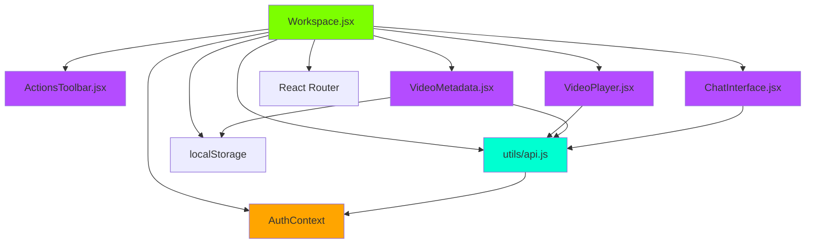
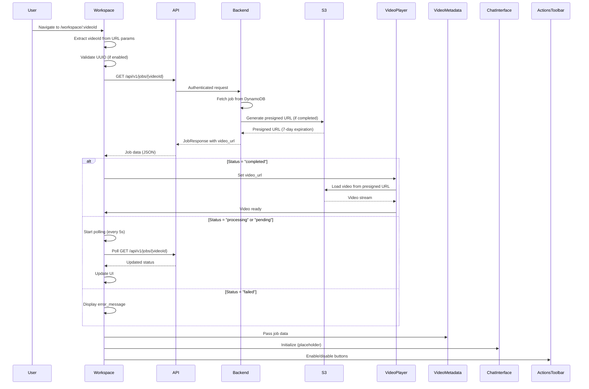
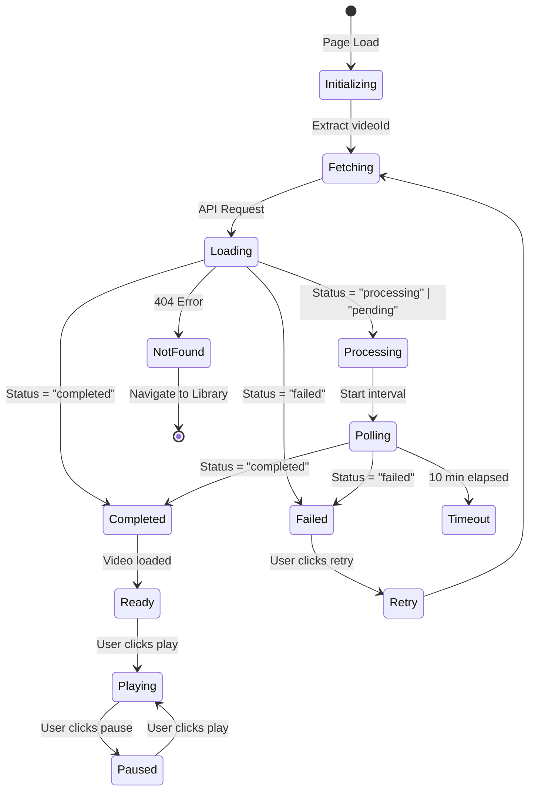
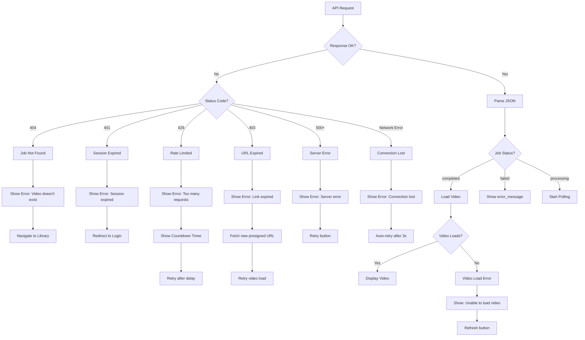

# Workspace Page - Architecture Diagram

> **Project:** OmniGen AI Video Generation Platform  
> **Feature:** Video Workspace / Editor Page  
> **Version:** 1.0  
> **Last Updated:** November 16, 2025  
> **Status:** Draft

---

## Executive Summary

This document provides visual architecture diagrams for the Workspace page, showing component structure, data flow, state management, API integration, and user interaction patterns. These diagrams serve as a blueprint for implementation.

---

## Table of Contents

1. [Component Hierarchy](#component-hierarchy)
2. [Page Layout Structure](#page-layout-structure)
3. [Data Flow Diagram](#data-flow-diagram)
4. [State Management Architecture](#state-management-architecture)
5. [API Integration Flow](#api-integration-flow)
6. [User Interaction Flows](#user-interaction-flows)
7. [Error Handling Architecture](#error-handling-architecture)
8. [Polling Mechanism](#polling-mechanism)

---

## Component Hierarchy

### High-Level Component Tree

```
App (App.jsx)
└── ThemeProvider
    └── AppLayout (Sidebar + Main Content)
        └── Workspace (pages/Workspace.jsx) ← Main Page Component
            ├── Breadcrumbs (inline)
            ├── ActionsToolbar (components/workspace/ActionsToolbar.jsx)
            ├── VideoPlayer (components/workspace/VideoPlayer.jsx)
            ├── VideoMetadata (components/workspace/VideoMetadata.jsx)
            └── ChatInterface (components/workspace/ChatInterface.jsx)
```

### Component Dependency Graph



**Legend:**

- 🟢 Green: Main page component
- 🟣 Purple: Workspace-specific components
- 🔵 Teal: Utility/Service layer
- 🟠 Orange: External dependencies

---

## Page Layout Structure

### Visual Layout Diagram

```
┌─────────────────────────────────────────────────────────────────────────┐
│  AppLayout (Existing - Sidebar + Main Container)                       │
├─────────────────────────────────────────────────────────────────────────┤
│                                                                         │
│  ┌─────────────────────────────────────────────────────────────────┐ │
│  │  Workspace.jsx (Main Container)                                  │ │
│  │                                                                   │ │
│  │  ┌───────────────────────────────────────────────────────────┐ │ │
│  │  │  Breadcrumbs: Library / Video Editor                       │ │ │
│  │  │  [ActionsToolbar: Download | Delete]                       │ │ │
│  │  └───────────────────────────────────────────────────────────┘ │ │
│  │                                                                   │ │
│  │  ┌───────────────────────────────────────────────────────────┐ │ │
│  │  │  VideoPlayer.jsx                                           │ │ │
│  │  │  ┌─────────────────────────────────────────────────────┐ │ │ │
│  │  │  │  <video> element (HTML5)                             │ │ │ │
│  │  │  │  Controls: Play/Pause, Seek, Volume, Fullscreen     │ │ │ │
│  │  │  └─────────────────────────────────────────────────────┘ │ │ │
│  │  └───────────────────────────────────────────────────────────┘ │ │
│  │                                                                   │ │
│  │  ┌──────────────────────────┐  ┌─────────────────────────────┐ │ │
│  │  │  VideoMetadata.jsx       │  │  ChatInterface.jsx           │ │ │
│  │  │  (30% width)             │  │  (70% width)                │ │ │
│  │  │                          │  │                              │ │ │
│  │  │  • Title (editable)     │  │  • Message History           │ │ │
│  │  │  • Duration              │  │  • User Messages            │ │ │
│  │  │  • Aspect Ratio          │  │  • System Messages          │ │ │
│  │  │  • Model                 │  │  • Input Field               │ │ │
│  │  │  • Cost                  │  │  • Submit Button (disabled)   │ │ │
│  │  │  • Status Badge         │  │                              │ │ │
│  │  │  • Original Prompt      │  │                              │ │ │
│  │  │  • Created At           │  │                              │ │ │
│  │  └──────────────────────────┘  └─────────────────────────────┘ │ │
│  │                                                                   │ │
│  └─────────────────────────────────────────────────────────────────┘ │
│                                                                         │
└─────────────────────────────────────────────────────────────────────────┘
```

### Responsive Layout (Mobile)

```
┌─────────────────────────────────┐
│  Workspace.jsx (Mobile)         │
├─────────────────────────────────┤
│  [← Library]  [Download] [Del] │
│                                 │
│  ┌───────────────────────────┐ │
│  │  VideoPlayer.jsx           │ │
│  │  (Full width)              │ │
│  └───────────────────────────┘ │
│                                 │
│  ┌───────────────────────────┐ │
│  │  VideoMetadata.jsx         │ │
│  │  (Collapsible Accordion)   │ │
│  └───────────────────────────┘ │
│                                 │
│  ┌───────────────────────────┐ │
│  │  ChatInterface.jsx        │ │
│  │  (Full width, bottom)    │ │
│  └───────────────────────────┘ │
└─────────────────────────────────┘
```

---

## Data Flow Diagram

### Initial Page Load Flow



### Component Data Flow

```
┌─────────────────────────────────────────────────────────────┐
│  Workspace.jsx (State Container)                               │
│  ┌─────────────────────────────────────────────────────────┐ │
│  │  State:                                                  │ │
│  │  • jobData: { job_id, status, prompt, video_url, ... } │ │
│  │  • loading: boolean                                     │ │
│  │  • error: string | null                                 │ │
│  │  • pollingInterval: number | null                      │ │
│  └─────────────────────────────────────────────────────────┘ │
└─────────────────────────────────────────────────────────────────┘
         │                    │                    │                    │
         │                    │                    │                    │
         ▼                    ▼                    ▼                    ▼
┌──────────────┐  ┌──────────────┐  ┌──────────────┐  ┌──────────────┐
│ VideoPlayer  │  │ VideoMetadata│  │ChatInterface │  │ActionsToolbar│
│              │  │              │  │              │  │              │
│ Props:       │  │ Props:       │  │ Props:       │  │ Props:       │
│ • videoUrl   │  │ • jobData    │  │ • jobData    │  │ • jobData    │
│ • status     │  │ • onTitleEdit│  │ • (placeholder)│ │ • onDownload │
│              │  │              │  │              │  │ • onDelete   │
│ State:       │  │ State:       │  │ State:       │  │              │
│ • isPlaying  │  │ • title      │  │ • messages   │  │              │
│ • currentTime│  │ (localStorage)│  │ (localStorage)│  │              │
│ • duration   │  │              │  │              │  │              │
└──────────────┘  └──────────────┘  └──────────────┘  └──────────────┘
```

---

## State Management Architecture

### State Flow Diagram



### State Management Strategy

**Workspace.jsx (Parent State):**

```javascript
// Centralized state in Workspace.jsx
const [jobData, setJobData] = useState(null);
const [loading, setLoading] = useState(true);
const [error, setError] = useState(null);
const [pollingInterval, setPollingInterval] = useState(null);
```

**Component-Level State:**

- **VideoPlayer:** Local state for playback (isPlaying, currentTime, duration)
- **VideoMetadata:** Local state for editable title (synced to localStorage)
- **ChatInterface:** Local state for messages array (stored in localStorage)
- **ActionsToolbar:** No local state (pure presentation)

**State Updates:**

```
User Action → Component Event → Workspace Handler → API Call → State Update → Re-render
```

---

## API Integration Flow

### API Request Flow

```
┌─────────────────────────────────────────────────────────────────┐
│  Component (e.g., Workspace.jsx)                              │
│  ┌───────────────────────────────────────────────────────────┐ │
│  │  import { jobs } from '../utils/api.js'                   │ │
│  │  const data = await jobs.get(videoId)                     │ │
│  └───────────────────────────────────────────────────────────┘ │
└─────────────────────────────────────────────────────────────────┘
                            │
                            ▼
┌─────────────────────────────────────────────────────────────────┐
│  utils/api.js                                                   │
│  ┌───────────────────────────────────────────────────────────┐ │
│  │  export const jobs = {                                    │ │
│  │    get: (id) => apiRequest(`/api/v1/jobs/${id}`)         │ │
│  │  }                                                        │ │
│  │                                                            │ │
│  │  function apiRequest(url) {                                 │ │
│  │    // 1. Get JWT from AuthContext                         │ │
│  │    // 2. Add Authorization header                         │ │
│  │    // 3. Add credentials: 'include'                      │ │
│  │    // 4. Handle errors (401, 404, 429, etc.)              │ │
│  │    return fetch(url, { ... })                             │ │
│  │  }                                                         │ │
│  └───────────────────────────────────────────────────────────┘ │
└─────────────────────────────────────────────────────────────────┘
                            │
                            ▼
┌─────────────────────────────────────────────────────────────────┐
│  Backend API (Go/Gin)                                            │
│  ┌───────────────────────────────────────────────────────────┐ │
│  │  GET /api/v1/jobs/{jobId}                                 │ │
│  │  • Auth Middleware (JWT validation)                      │ │
│  │  • Rate Limit Middleware                                 │ │
│  │  • Handler: GetJob(jobId)                                 │ │
│  │  • Repository: Fetch from DynamoDB                        │ │
│  │  • S3: Generate presigned URL (if completed)             │ │
│  │  • Response: JobResponse JSON                            │ │
│  └───────────────────────────────────────────────────────────┘ │
└─────────────────────────────────────────────────────────────────┘
```

### API Endpoints Used

| Endpoint               | Method | Component              | Purpose                         |
| ---------------------- | ------ | ---------------------- | ------------------------------- |
| `/api/v1/jobs/{jobId}` | GET    | Workspace              | Fetch job data and video URL    |
| `/api/v1/jobs/{jobId}` | GET    | Workspace (polling)    | Check status updates            |
| `/api/v1/generate`     | POST   | ChatInterface (future) | Create new generation from edit |

---

## User Interaction Flows

### Flow 1: View Video (Completed Status)

```
User → Navigate to /workspace/:videoId
  ↓
Workspace extracts videoId
  ↓
API: GET /api/v1/jobs/{videoId}
  ↓
Backend returns: { status: "completed", video_url: "..." }
  ↓
Workspace sets jobData state
  ↓
VideoPlayer receives video_url
  ↓
VideoPlayer loads video from S3 presigned URL
  ↓
User sees video with controls
  ↓
User clicks Play → Video plays
```

### Flow 2: View Video (Processing Status)

```
User → Navigate to /workspace/:videoId
  ↓
Workspace extracts videoId
  ↓
API: GET /api/v1/jobs/{videoId}
  ↓
Backend returns: { status: "processing", video_url: null }
  ↓
Workspace starts polling (every 5s)
  ↓
Workspace displays: "Processing... X%"
  ↓
[Every 5s] API: GET /api/v1/jobs/{videoId}
  ↓
Backend returns updated status
  ↓
When status = "completed":
  ↓
Workspace stops polling
  ↓
Workspace fetches new job data (with video_url)
  ↓
VideoPlayer loads video
```

### Flow 3: Download Video

```
User clicks Download button
  ↓
ActionsToolbar.onDownload() called
  ↓
Workspace fetches video_url from jobData
  ↓
Create temporary <a> element with download attribute
  ↓
Set href to video_url (presigned S3 URL)
  ↓
Trigger click() programmatically
  ↓
Browser downloads video file
```

### Flow 4: Delete Video (Future)

```
User clicks Delete button
  ↓
ActionsToolbar shows confirmation modal
  ↓
User confirms deletion
  ↓
API: DELETE /api/v1/jobs/{videoId} (future endpoint)
  ↓
Backend deletes job from DynamoDB
  ↓
Backend deletes video from S3
  ↓
Workspace navigates to /library
```

### Flow 5: AI Chat (MVP Placeholder)

```
User types edit request in ChatInterface
  ↓
User clicks "Edit (Coming Soon)" button
  ↓
ChatInterface shows disabled state
  ↓
System message displayed:
  "Edit functionality coming soon!
   Create a new generation with your changes?"
  ↓
User clicks "Create New Video" link
  ↓
Navigate to /create with pre-filled prompt
  ↓
Create page shows modified prompt
```

---

## Error Handling Architecture

### Error Flow Diagram



### Error Handling Matrix

| Error Type                | Detection          | User Message                                     | Recovery Action                   | Component   |
| ------------------------- | ------------------ | ------------------------------------------------ | --------------------------------- | ----------- |
| **404 - Job Not Found**   | HTTP 404           | "This video doesn't exist or has been deleted."  | Navigate to Library               | Workspace   |
| **401 - Session Expired** | HTTP 401           | "Your session has expired. Please log in again." | Redirect to /login                | Workspace   |
| **429 - Rate Limited**    | HTTP 429           | "Too many requests. Please wait {X} seconds."    | Show countdown, retry after delay | Workspace   |
| **403 - URL Expired**     | HTTP 403 (from S3) | "Video link expired. Refreshing..."              | Fetch new presigned URL           | VideoPlayer |
| **500+ - Server Error**   | HTTP 500-599       | "Server error. Please try again."                | Show retry button                 | Workspace   |
| **Network Error**         | Fetch fails        | "Connection lost. Check your internet."          | Auto-retry after 3s               | Workspace   |
| **Video Load Failure**    | Video error event  | "Unable to load video. Please try again."        | Refresh button                    | VideoPlayer |
| **Job Failed**            | status = "failed"  | "Video generation failed: {error_message}"       | Show error, "Try Again" button    | Workspace   |

---

## Polling Mechanism

### Polling Flow Diagram

```
┌─────────────────────────────────────────────────────────────┐
│  Workspace.jsx                                               │
│                                                              │
│  useEffect(() => {                                           │
│    if (jobData?.status === 'processing' ||                    │
│        jobData?.status === 'pending') {                      │
│                                                              │
│      const interval = setInterval(async () => {              │
│        ┌──────────────────────────────────────────────┐      │
│        │  1. API: GET /api/v1/jobs/{videoId}        │      │
│        │  2. Check response status                  │      │
│        │  3. Update jobData state                    │      │
│        │  4. If completed/failed: clearInterval()   │      │
│        └──────────────────────────────────────────────┘      │
│      }, 5000); // 5 seconds                                  │
│                                                              │
│      setPollingInterval(interval);                           │
│                                                              │
│      // Timeout after 10 minutes                            │
│      setTimeout(() => {                                      │
│        clearInterval(interval);                             │
│        setError("Generation taking longer than expected...");│
│      }, 600000); // 10 minutes                               │
│    }                                                          │
│                                                              │
│    return () => {                                            │
│      if (pollingInterval) clearInterval(pollingInterval);   │
│    };                                                         │
│  }, [videoId, jobData?.status]);                              │
└─────────────────────────────────────────────────────────────┘
```

### Polling State Machine

```
[Initial Load]
    │
    ▼
[Status = "processing" or "pending"]
    │
    ▼
[Start Polling Interval (5s)]
    │
    ├───► [Poll: GET /api/v1/jobs/{videoId}]
    │         │
    │         ├───► [Status = "completed"] ──► [Stop Polling] ──► [Load Video]
    │         │
    │         ├───► [Status = "failed"] ──► [Stop Polling] ──► [Show Error]
    │         │
    │         └───► [Status = "processing"] ──► [Continue Polling]
    │
    ├───► [10 minutes elapsed] ──► [Stop Polling] ──► [Show Timeout Message]
    │
    └───► [Component Unmount] ──► [Cleanup Interval]
```

### Polling Optimization

**When to Poll:**

- ✅ Status is "pending" or "processing"
- ✅ Video URL is null/undefined
- ✅ User is still on the page

**When NOT to Poll:**

- ❌ Status is "completed" or "failed"
- ❌ Component is unmounted
- ❌ 10-minute timeout reached
- ❌ User navigates away

**Polling Frequency:**

- **Interval:** 5 seconds (5000ms)
- **Timeout:** 10 minutes (600000ms)
- **Rationale:** Balance between responsiveness and server load

---

## Component Communication Patterns

### Parent-Child Communication

```
Workspace.jsx (Parent)
    │
    ├───► Props Down: jobData, loading, error
    │
    ├───► VideoPlayer
    │       Props: videoUrl, status, onError
    │       Events: onPlay, onPause, onTimeUpdate
    │
    ├───► VideoMetadata
    │       Props: jobData, onTitleChange
    │       Events: onTitleEdit (localStorage)
    │
    ├───► ChatInterface
    │       Props: jobData (placeholder)
    │       Events: onMessageSubmit (disabled in MVP)
    │
    └───► ActionsToolbar
            Props: jobData, onDownload, onDelete
            Events: onClick handlers
```

### Event Flow

```
User Action
    │
    ▼
Component Event Handler
    │
    ▼
Workspace Handler Function
    │
    ▼
API Call (if needed)
    │
    ▼
State Update (setState)
    │
    ▼
Re-render Components
    │
    ▼
UI Update
```

---

## File Structure Visualization

```
frontend/src/
│
├── pages/
│   └── Workspace.jsx                    ← Main container
│       ├── Imports: React, Router, components
│       ├── State: jobData, loading, error, polling
│       ├── Effects: Fetch job, polling logic
│       └── Render: Layout with 4 child components
│
├── components/
│   └── workspace/                        ← New folder
│       │
│       ├── VideoPlayer.jsx              ← Video playback
│       │   ├── Props: videoUrl, status
│       │   ├── State: isPlaying, currentTime, duration
│       │   ├── Handlers: play, pause, seek, volume
│       │   └── HTML5 <video> element
│       │
│       ├── VideoMetadata.jsx            ← Video info panel
│       │   ├── Props: jobData
│       │   ├── State: title (localStorage)
│       │   ├── Calculated: cost, model, resolution, timeAgo
│       │   └── Display: All metadata fields
│       │
│       ├── ChatInterface.jsx             ← AI chat (placeholder)
│       │   ├── Props: jobData
│       │   ├── State: messages (localStorage)
│       │   ├── Input: Disabled in MVP
│       │   └── Display: Info message + link to Create
│       │
│       └── ActionsToolbar.jsx            ← Action buttons
│           ├── Props: jobData, onDownload, onDelete
│           ├── Buttons: Download, Delete
│           └── Modals: Delete confirmation
│
├── styles/
│   └── workspace.css                    ← Workspace styling
│       ├── Layout: Grid, flexbox
│       ├── Components: VideoPlayer, Metadata, Chat
│       ├── Responsive: Mobile breakpoints
│       └── Aurora theme colors
│
└── utils/
    └── api.js                           ← API utilities
        ├── Existing: apiRequest, generate.create
        └── New: jobs.get(), jobs.list()
```

---

## Technology Stack

### Frontend Stack

```
┌─────────────────────────────────────────┐
│  React 18                               │
│  ├── Hooks: useState, useEffect, useRef │
│  └── Context: AuthContext (existing)    │
└─────────────────────────────────────────┘
            │
            ▼
┌─────────────────────────────────────────┐
│  React Router v6                        │
│  ├── useParams: Extract videoId        │
│  ├── useNavigate: Navigation           │
│  └── Route: /workspace/:videoId        │
└─────────────────────────────────────────┘
            │
            ▼
┌─────────────────────────────────────────┐
│  HTML5 Video API                        │
│  ├── <video> element                    │
│  ├── Events: play, pause, timeupdate    │
│  └── Methods: play(), pause(), seek()   │
└─────────────────────────────────────────┘
            │
            ▼
┌─────────────────────────────────────────┐
│  Browser APIs                           │
│  ├── Fetch API (via utils/api.js)      │
│  ├── localStorage (title, messages)     │
│  └── URL.createObjectURL (download)   │
└─────────────────────────────────────────┘
            │
            ▼
┌─────────────────────────────────────────┐
│  External Libraries                     │
│  └── date-fns (relative time)          │
└─────────────────────────────────────────┘
```

### Backend Integration

```
Frontend (React)
    │
    │ HTTP/HTTPS
    │ JWT Bearer Token
    │
    ▼
Backend API (Go/Gin)
    │
    ├──► DynamoDB (Job metadata)
    ├──► S3 (Video storage + presigned URLs)
    ├──► Step Functions (Video generation)
    └──► Cognito (JWT validation)
```

---

## Security Architecture

### Authentication Flow

```
User Request
    │
    ▼
AuthContext (existing)
    │
    ├──► JWT Token (from Cognito)
    │
    ▼
utils/api.js
    │
    ├──► Add Authorization: Bearer {jwt}
    │
    ▼
Backend Middleware
    │
    ├──► Validate JWT
    │
    ▼
Handler (if authenticated)
```

### Data Security

- **JWT Tokens:** Stored in AuthContext (existing implementation)
- **Presigned URLs:** 7-day expiration, user-specific
- **CORS:** Configured for localhost (dev) and CloudFront (prod)
- **Rate Limiting:** 100 requests/minute per user (backend enforced)

---

## Audio Quality & Sync Validation

### Volume Mixing

- **Background Music Track**: Played via hidden `<audio>` element with base gain `MUSIC_BASE_VOLUME = 0.3`. Workspace volume slider scales this value (e.g., slider at 50 % → music at 0.15).
- **Narrator Track**: Separate `<audio>` element using `NARRATOR_BASE_VOLUME = 1.0`; slider scales linearly to maintain clarity over music.
- **Video Element**: Permanently muted (`volume = 0`, `muted = true`) so all audible content is driven by the dedicated tracks.

### Synchronization Strategy

- **Drift Detection**: 500 ms interval compares `<video>` currentTime against music and narrator tracks.
- **Auto-Resync**: When drift exceeds 0.2 s (`DRIFT_RESYNC_THRESHOLD`), playback snaps audio tracks to the video timestamp.
- **Warning Threshold**: If drift surpasses 0.5 s (`DRIFT_WARNING_THRESHOLD`), a toast notification appears; repeat warnings follow a 5 s cooldown (`DRIFT_WARNING_COOLDOWN_MS`).
- **Target Accuracy**: Under normal network conditions, playback maintains ±0.1 s alignment; post-seek drift resolves within a single resync cycle.

### Testing Protocol (Task 5.2)

- Manual checklist documented in `frontend/src/tests/audio-quality-test.md` covering Chrome/Safari/Firefox (desktop) and iOS Safari / Android Chrome (mobile).
- Validated volume scaling at 0 %, 50 %, and 100 %; narrator remains intelligible above background music on all tested outputs.
- Confirmed side effects narration accelerates to 1.4× during the final 20 % of the video while staying aligned with overlay timing.
- Executed `ffmpeg -af astats` on background music and narrator exports; peak levels remained below −0.1 dBFS confirming zero clipping.
- Evaluated playback on headphones, laptop speakers, and external speakers to ensure consistent balance.

### Known Limitations

- Mobile browsers require user interaction to initiate audio (autoplay policies); player prompts manual start when necessary.
- Brief drift spikes may appear on low-powered devices during network stalls; automatic resync corrects within the 0.5 s threshold.
- Audio fidelity relies on upstream generation services (TTS, music); current QA assumes source assets meet quality baselines.

---

## Performance Considerations

### Optimization Strategies

1. **Lazy Loading:**

   - Video loads only when `video_url` is available
   - Components render conditionally based on status

2. **Polling Optimization:**

   - Poll only when status is "processing" or "pending"
   - Stop polling immediately when status changes
   - Cleanup intervals on unmount

3. **State Management:**

   - Centralized state in Workspace.jsx
   - Minimal re-renders (only update changed components)
   - localStorage for non-critical data (title, messages)

4. **Video Loading:**
   - Progressive loading (browser handles buffering)
   - Error handling for slow/failed loads
   - Retry mechanism for expired URLs

---

## Appendix

### Diagram Legend

- **Solid Arrow (→):** Data flow / API call
- **Dashed Arrow (⇢):** User interaction
- **Double Arrow (⇄):** Bidirectional communication
- **Box with border:** Component / Module
- **Rounded box:** State / Data
- **Diamond:** Decision point

### References

- [Workspace PRD](./workspace-prd.md)
- [OmniGen Design Spec](../existing_infra_saturday/omnigen_design_spec.md)
- [Video Workflow](../existing_infra_saturday/video-workflow.md)
- [Data Flow](../existing_infra_saturday/data-flow.md)

---

**End of Architecture Document**
